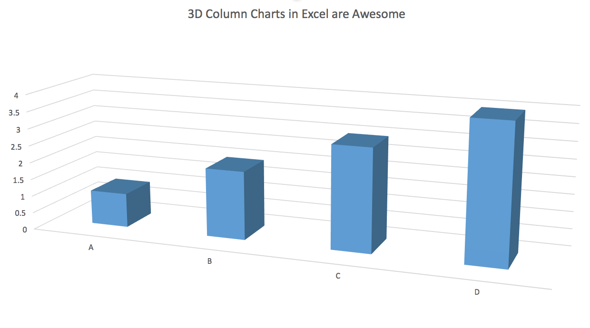
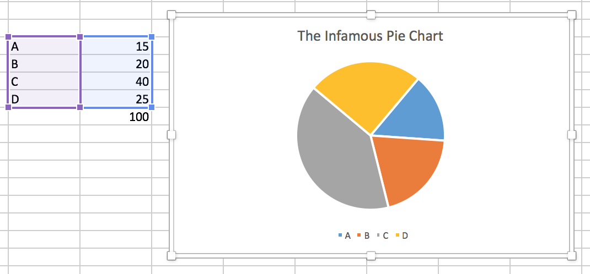
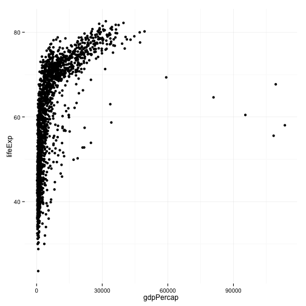

## What Data Values are Displayed in this Figure?



---

## 


---


## What about this one?


---

## 



---


## Let's get some Data ...


```r
library(ggplot2)
library(devtools)

gapminder.url <- "https://raw.githubusercontent.com/socviz/soc880/master/data/gapminder.csv"
data <- read.csv(url(gapminder.url))
head(data)
```

```
##   country continent year lifeExp      pop gdpPercap
## 1 Algeria    Africa 1952  43.077  9279525  2449.008
## 2 Algeria    Africa 1957  45.685 10270856  3013.976
## 3 Algeria    Africa 1962  48.303 11000948  2550.817
## 4 Algeria    Africa 1967  51.407 12760499  3246.992
## 5 Algeria    Africa 1972  54.518 14760787  4182.664
## 6 Algeria    Africa 1977  58.014 17152804  4910.417
```

---

## ... and Plot it


```r
p <- ggplot(data, aes(x=gdpPercap, y=lifeExp))
p + geom_point()
```



---
