<style type='text/css'>
.reveal {
  font-size: 28px;  
}
</style>


# Getting used to ggplot

## Data Visualization, Week 2

### Kieran Healy, Duke University

---

## Outline for Today

0. Housekeeping
1. Basic Principles Again
2. Introducing `ggplot`
3. Summarizing a Variable

--- 

## How to Navigate these Slides

- When you view them online, notice the compass in the bottom right corner
- You can go left or right, or sometimes down to more detail.
- Hit the `Escape` key to get an overview of all the slides. On a phone
  or tablet, pinch to get the slide overview.
- You can use the arrow keys (or swipe up and down) in this view, as well. 
- Hit `Escape` again to return to the slide you were looking at. 
- On a phone or tablet, tap the slide you want.

---

## Reminder

- There are two ways to learn R: the easy way and the tedious way. 
- The problem is that the easy way doesn't work.
- You have to practice the examples and work through them manually.
  Type them out, even if you're just copying at the beginning. It
  really will help you get used to how the language works.

--- 

## Reminder

- You will benefit a lot from taking almost any R tutorial, whether from a textbook or online. The syllabus has links. 
- For example, [Try R](http://tryr.codeschool.com/levels/1/challenges/1).

---

# Principles Again

---

## Perception

- Visualizing data is not just a matter of good taste.
- Basic perceptual processes play a very strong role.
- These have consequences for how we will want to encode data when we
  visualize it---i.e., how and whether we choose to represent numbers
  or categories as shapes, colors, lengths, etc.

---

## Perception

- We more easily see edges, contrasts, and movement.
- We judge relative differences rather than absolute values.
- We tend to infer relationships between elements based on
  gestalt-like rules.


---


- Hermann Grid Effect

---


- Contrast Effects 

---


- Color makes things more complex 

---

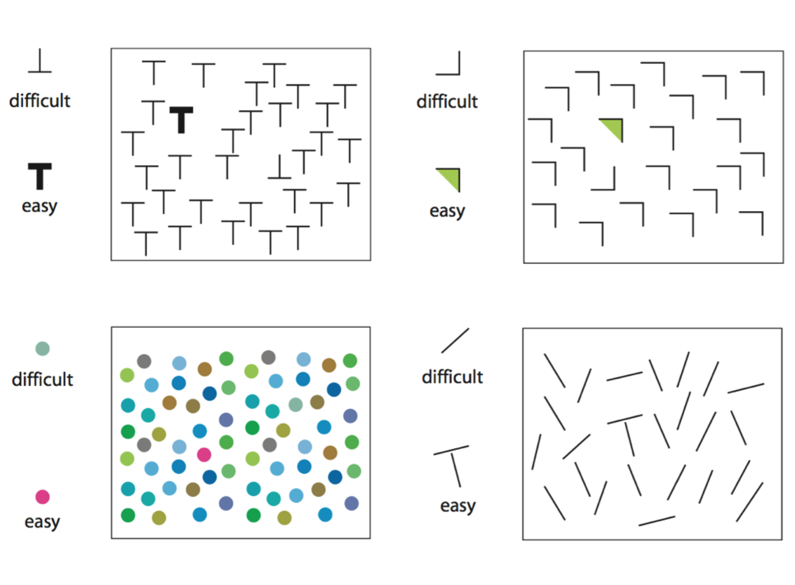

- Some things pop out more easily than others. (Examples from Miriah Meyer.)
- For more on perception, color, and cognitive processing of images, see [Miriah Meyer's Visualization Lectures](http://www.sci.utah.edu/~miriah/cs6630/), especially weeks 2 and 3.

---

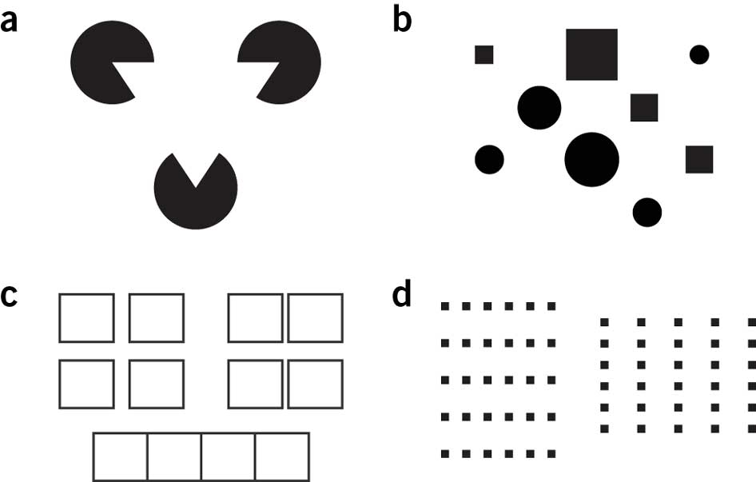

- Bang Wong, _Nature Methods_ 7 863 (2010)


---

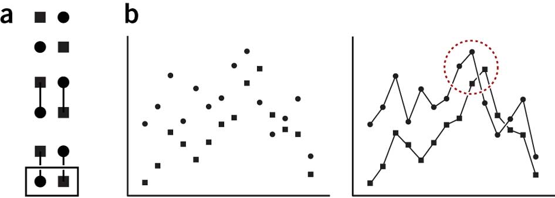

- Bang Wong, _Nature Methods_ 7 863 (2010)

---


 

- Example: Picking out a data point

---

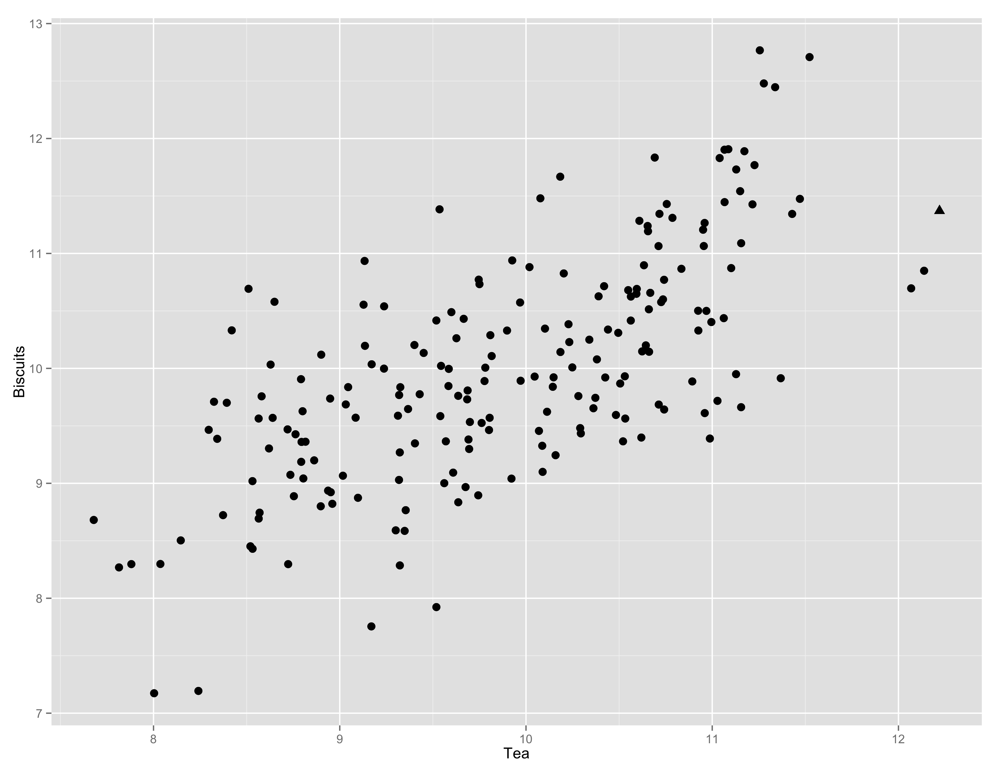 

- Highlight by shape

---


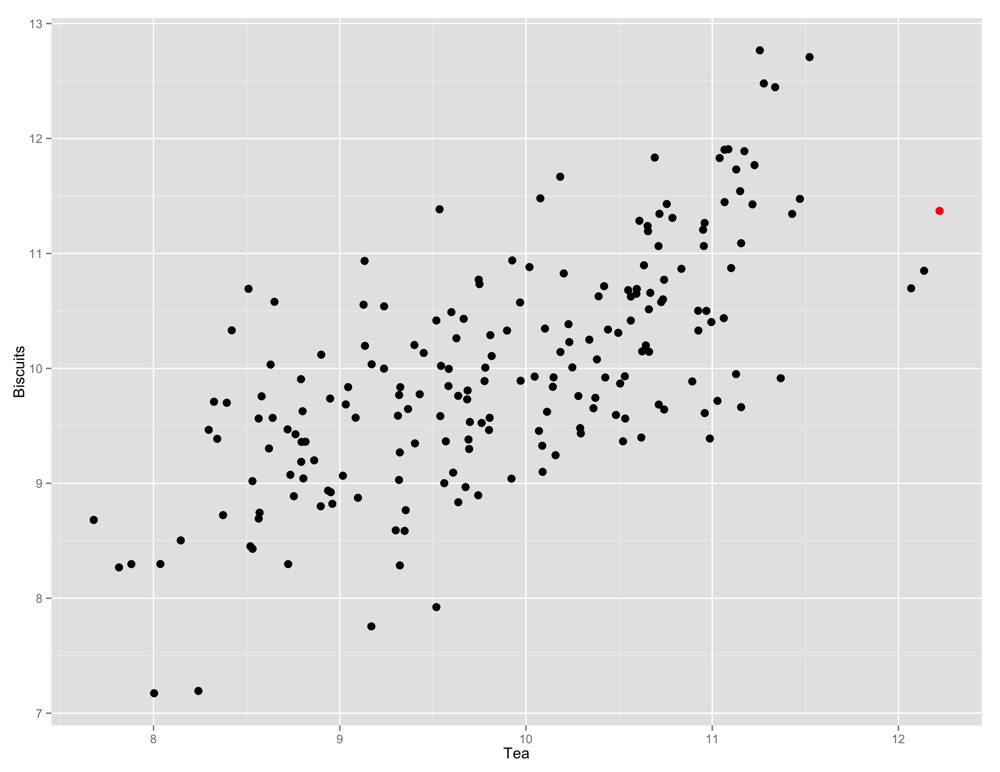 

- Highlight by color

---

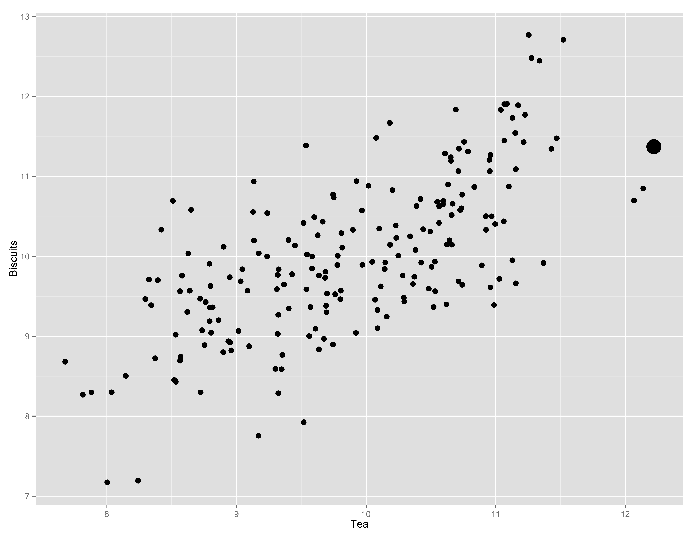 

- Highlight by size


---


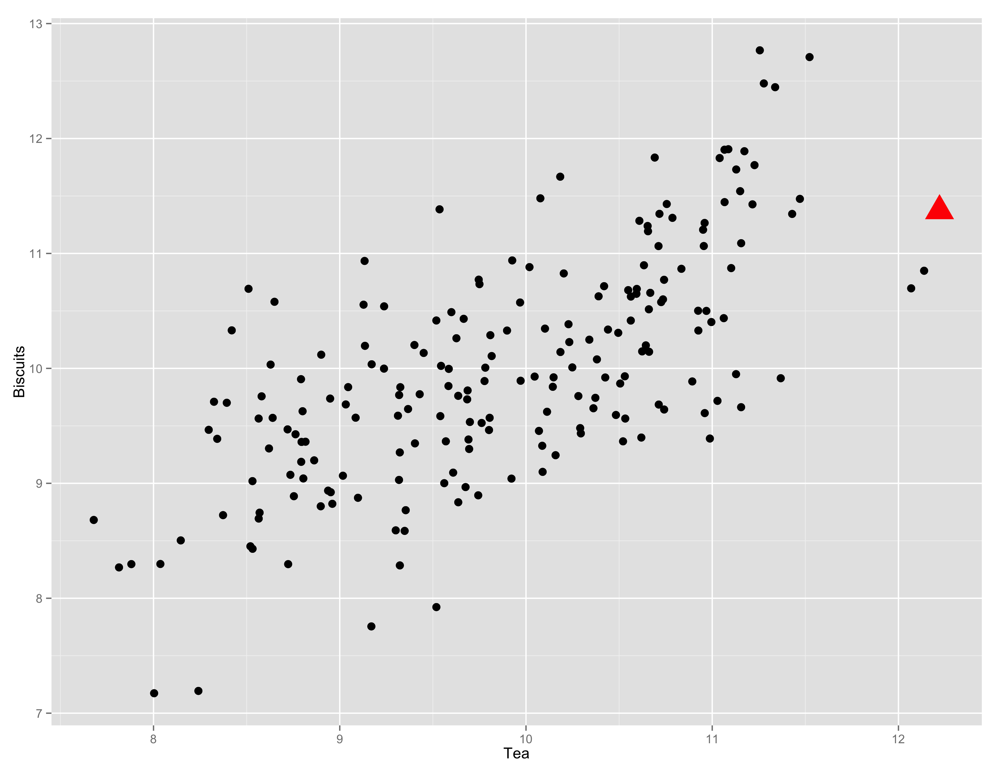 

- Highlight by all three

---

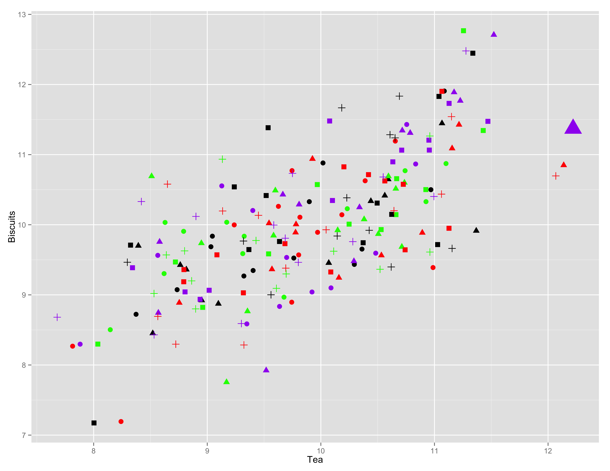 

- Multiple channels of comparison become uninterpretable very fast

---


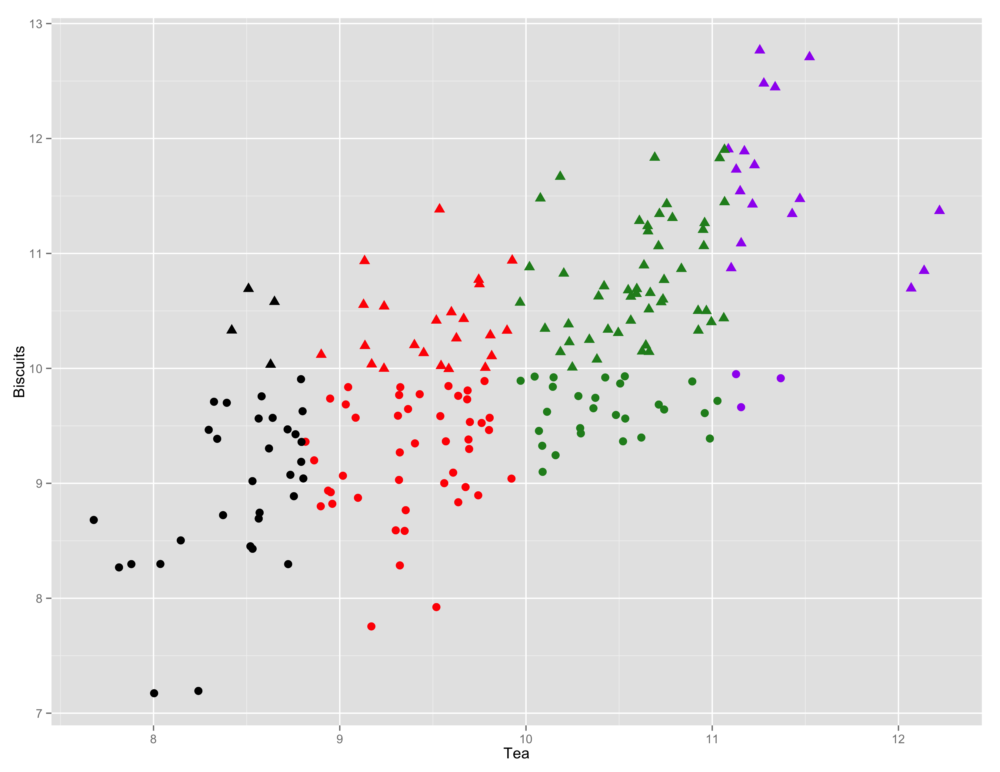 

- Unless your data has a lot of structure

---

<q> The data on the graph are the reason for the existence of the graph.</q>

Cleveland (1994, 25)

---

# Writing Plots

---

## Go get the Gapminder Data 


```r
gapminder.url <- "https://raw.githubusercontent.com/socviz/soc880/master/data/gapminder.csv"
my.data <- read.csv(url(gapminder.url))
dim(my.data)
```

```
## [1] 1704    6
```

```r
head(my.data)
```

```
##   country continent year lifeExp      pop gdpPercap
## 1 Algeria    Africa 1952  43.077  9279525  2449.008
## 2 Algeria    Africa 1957  45.685 10270856  3013.976
## 3 Algeria    Africa 1962  48.303 11000948  2550.817
## 4 Algeria    Africa 1967  51.407 12760499  3246.992
## 5 Algeria    Africa 1972  54.518 14760787  4182.664
## 6 Algeria    Africa 1977  58.014 17152804  4910.417
```

- Remember what we said before about everything being an object, and
  every object having a class.

---


```r
## We'll be a bit more verbose
## to make things clearer
p <- ggplot(data=my.data,
            aes(x=gdpPercap,
                y=lifeExp))
```

- `ggplot` works by building your plot piece by piece
- We start with a clean data frame called `my.data`
- Then we tell `ggplot` what pieces of it we are interested in right now.
- We create an object called `p` containing this information
- Here, `x=gfpPercap` and `y=lifeExp` say what will go on the `x` and the `y` axes
- These are *aesthetic mappings* that connect pieces of the data to things we can actually see on a plot.


---

## About aesthetic mappings

- The `aes()` function *links variables* to *things you will see* on the plot.
- The `x` and `y` values are the most obvious ones.
- Other aesthetic mappings include, e.g., `color`, `shape`, and `size`.
- These mappings are not *directly* specifying what specific, e.g.,
  colors or shapes will be on the plot. Rather they say which
  *variables* in the data will be *represented* by, e.g., colors and
  shapes on the plot.

---

### Adding layers to the plot

- What happens when you type `p` at the console and hit return?
- We need to add a *layer* to the plot. 


```r
p + geom_point()
```

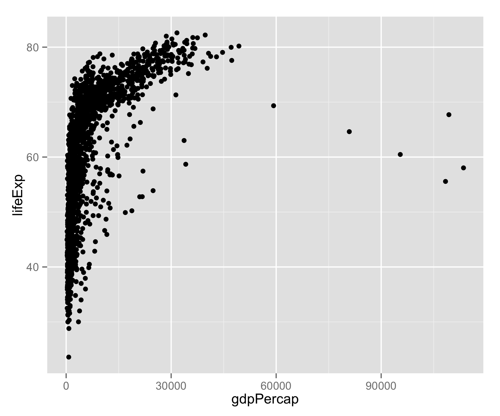 

- This takes the `p` object we've created, and applies `geom_point()`
  to it, a function that knows how to take `x` and `y` values and plot
  them in a scatterplot.


---

## The Plot-Making Process

#### 0. Start with your data in the right shape

#### 1. Tell `ggplot` *what* relationships you want to see

#### 2. Tell `ggplot` *how* you want to see them

#### 3. Layer these pictures as needed

#### 4. Fine-tune scales, labels, tick marks, etc

---

#### This layering process is literally additive


```r
p <- ggplot(my.data,
            aes(x=gdpPercap, y=lifeExp))

p + geom_point()
```

 

--- 


```r
p + geom_point() +
    geom_smooth(method="loess") 
```

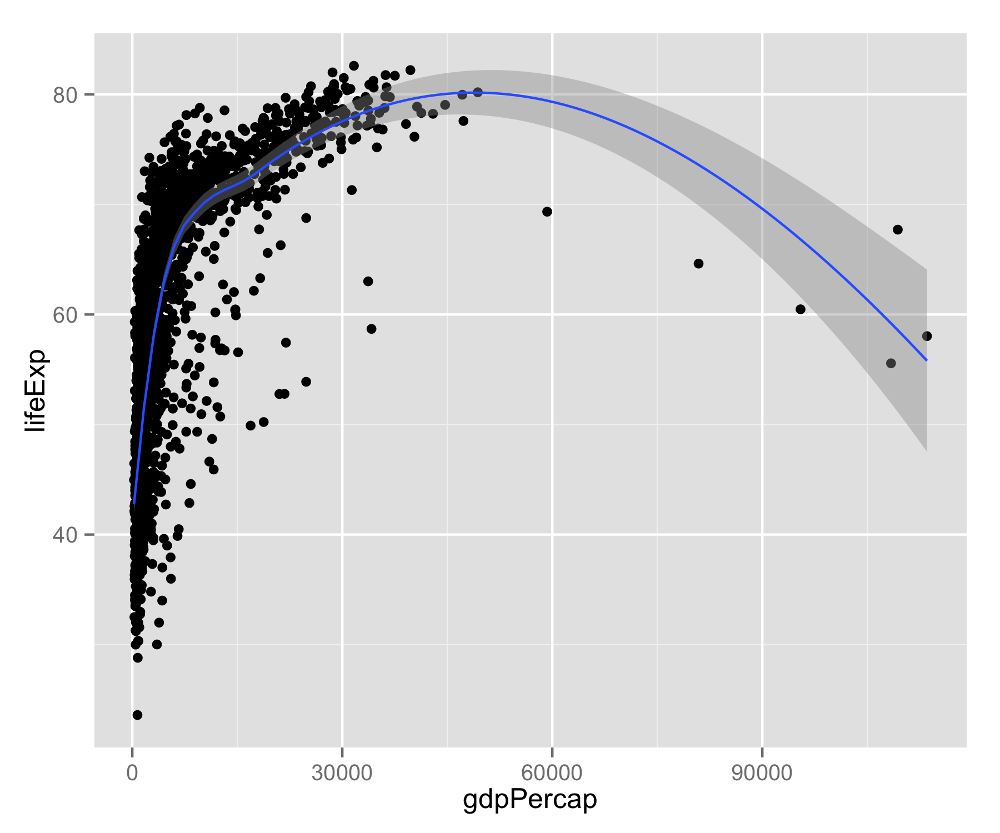 

- Here we add a second geom. It's a `loess` smoother. There are
  others. Try `lm`, for example.
- What happens when you put `geom_smooth()` first instead of second?
- Notice how both `geom_point` and `geom_smooth()` inherit the
  information in `p` about what the `x` and `y` variables are.


---


```r
p + geom_point() +
    geom_smooth(method="loess") +
    scale_x_log10()
```

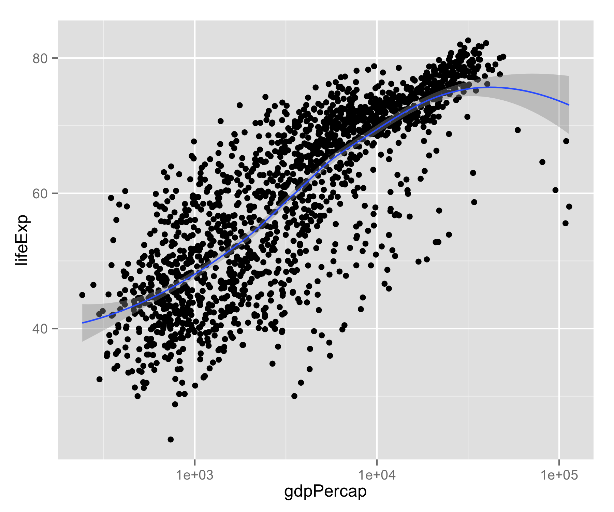 

- The next layer does not change anything in the underlying data. Instead it adjusts the x-axis scale. 

--- 


```r
p + geom_point(color="firebrick") +
    geom_smooth(method="loess") +
    scale_x_log10()
```

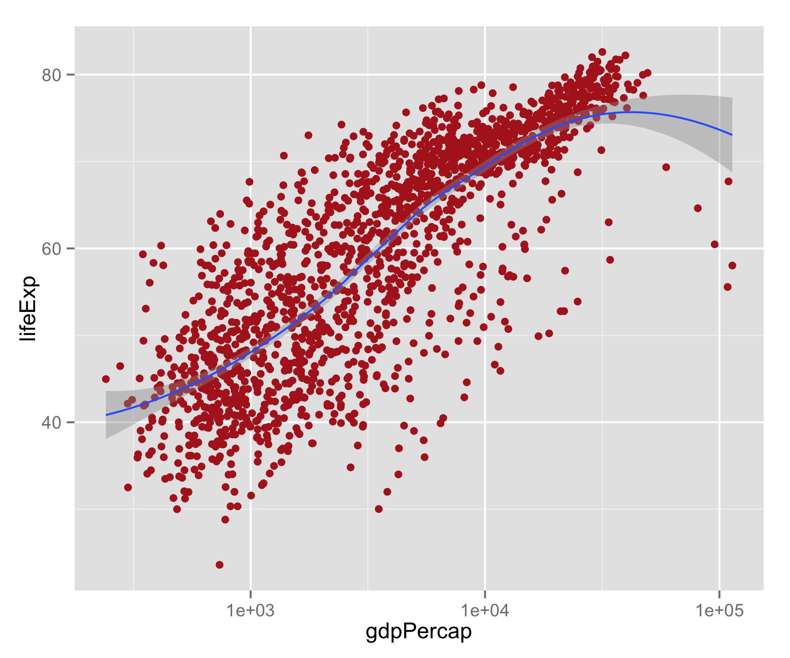 

- Here, notice we changed the color of the points by specifying the `color` argument in `geom_point()`
- This is called *setting* an aesthetic feature. 
- It has no relationship to the data. The color red is not representing or *mapping* any feature of the data.

--- 

- To see the difference between *setting* and *mapping* an aesthetic, let's go back to our `p` object and recreate it. 
- This time, in addition to `x` and `y` we tell `ggplot` to map the variable `Continent` to the `color` aesthetic.


```r
p <- ggplot(my.data,
            aes(x=gdpPercap,
                y=lifeExp,
                color=continent))
```

- Now there *is* a relationship or *mapping* between the data and the aesthetic.
- The values of the variable `continent` will be *represented* by colors on the figure we draw.

---


```r
p + geom_point() +
    scale_x_log10()
```

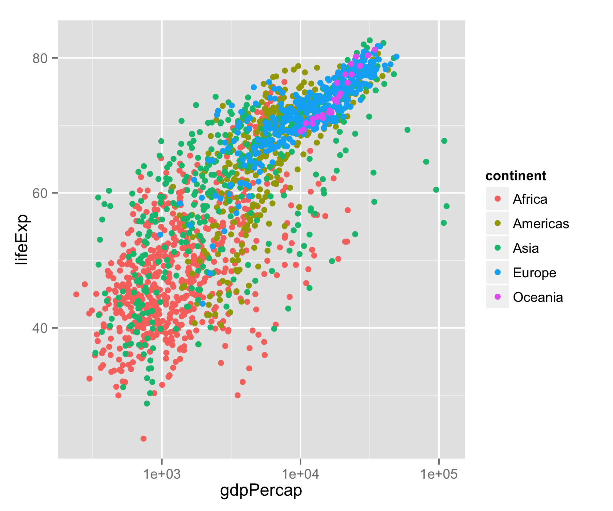 

- Like this. Notice that we did not have to manually specify any colors. 
- Instead we told `ggplot()` to *map* the values of `contintent` to the property, or *aesthetic*, of `color`
- Try mapping `continent` to the aesthetic `shape` instead


---

### Colorless green ideas sleep furiously

- `ggplot` implements a "grammar" of graphics, an idea developed by Leland Wilkinson (2005).
- The grammar gives you rules for how to map
  pieces of data to geometric objects (like points and lines) with
  attributes (like color and size), togehter with further rules for
  transforming the data if needed, adjusting scales, or projecting the
  results onto a coordinate system.
- A key point is that, like other rules of syntax, it limits what you
  can say but doesn't make what you say sensible or meaningful. 
- It allows you to produce "sentences" (mappings of data to objects)
but they can easily be garbled.

---

### More work needed (1)


```r
p + geom_line()
```

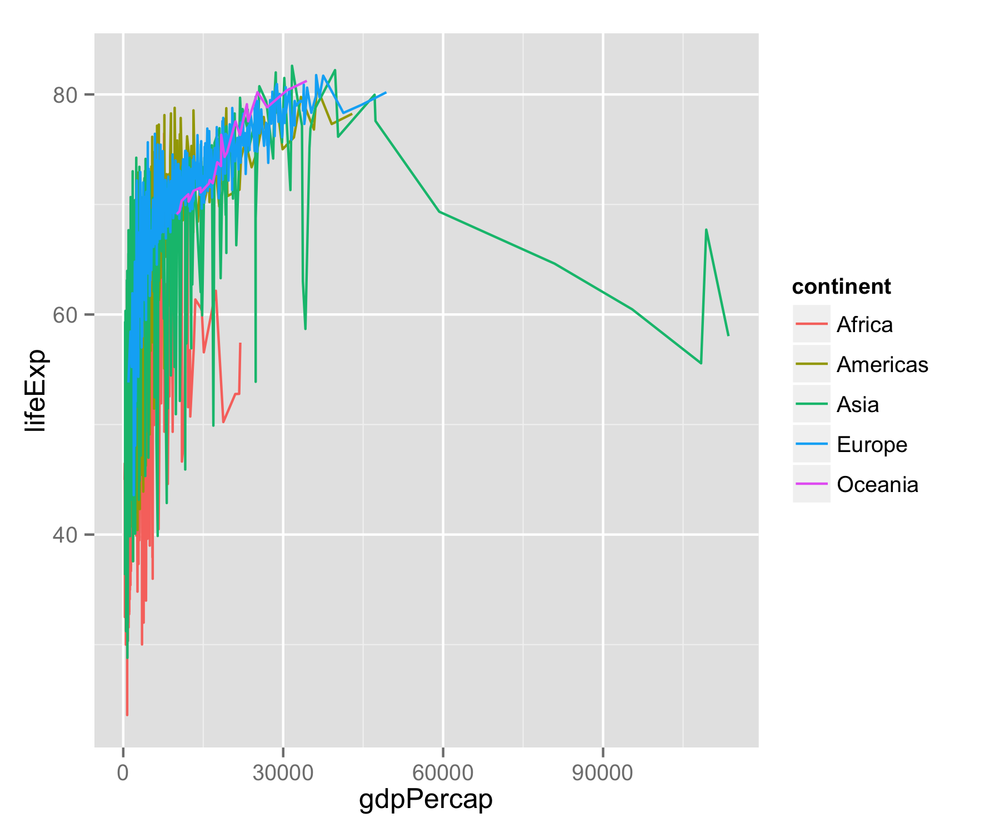 

---

### More work needed (2)


```r
p + geom_bar(stat="identity")
```

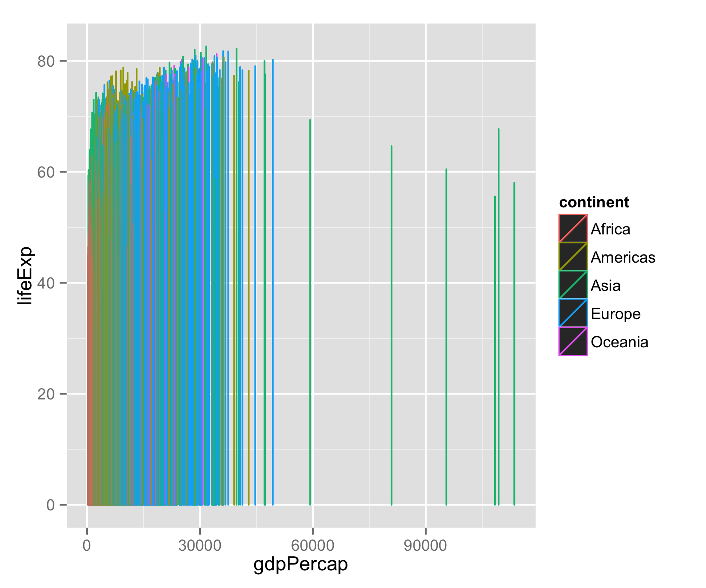 

----

### On the other hand, once you get used to it, this layered grammar lets you build up sophisticated plots

---


```r
p <- ggplot(my.data, aes(x=year, y=lifeExp))

p1 <- p + geom_line(color="gray70", aes(group=country)) +
    geom_smooth(size=1.1, method="loess")

p1 + facet_wrap(~ continent) + labs(x="Year", y="Life Expectancy")
```

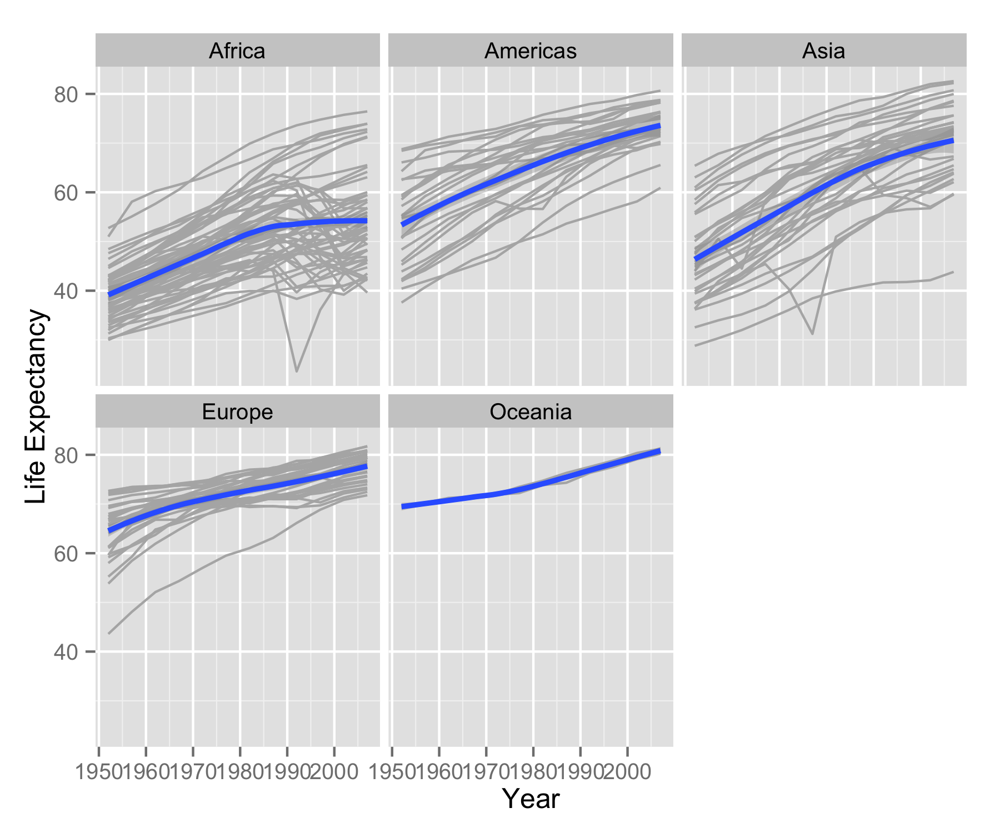 


---
