<style type='text/css'>
.reveal {
  font-size: 28px;  
}
</style>


# Looking at Data

## Data Visualization, Week 3

### Kieran Healy, Duke University

---

## Outline for Today

0. Housekeeping
1. Patterns in Data
2. Recapping `ggplot` fundamentals
3. Worked examples with the Gapminder Data
4. A new dataset
5. Dot plots and other 1-D summaries

--- 

## How to Navigate these Slides

- When you view them online, notice the compass in the bottom right corner
- You can go left or right, or sometimes down to more detail.
- Hit the `Escape` key to get an overview of all the slides. On a phone
  or tablet, pinch to get the slide overview.
- You can use the arrow keys (or swipe up and down) in this view, as well. 
- Hit `Escape` again to return to the slide you were looking at. 
- On a phone or tablet, tap the slide you want.

---

## Reminder

- There are two ways to learn R: the easy way and the tedious way. 
- The problem is that the easy way doesn't work.
- You have to practice the examples and work through them manually.
  Type them out, even if you're just copying at the beginning. It
  really will help you get used to how the language works.

---

### We're good at seeing patterns in data


- (Images: Peter Coles)

---

### Maybe a little too good


- (L) Random 2-D Poisson Process. 
- (R) Random Process with added spatial anti-correlation.
- (Images: Peter Coles)

---

## ggplot 


```r
gapminder.url <- "https://raw.githubusercontent.com/socviz/soc880/master/data/gapminder.csv"
my.data <- read.csv(url(gapminder.url))
dim(my.data)
```

```
## [1] 1704    6
```

```r
head(my.data)
```

```
##   country continent year lifeExp      pop gdpPercap
## 1 Algeria    Africa 1952  43.077  9279525  2449.008
## 2 Algeria    Africa 1957  45.685 10270856  3013.976
## 3 Algeria    Africa 1962  48.303 11000948  2550.817
## 4 Algeria    Africa 1967  51.407 12760499  3246.992
## 5 Algeria    Africa 1972  54.518 14760787  4182.664
## 6 Algeria    Africa 1977  58.014 17152804  4910.417
```

---


```r
## We'll be a bit more verbose
## to make things clearer
p <- ggplot(data=my.data,
            aes(x=gdpPercap,
                y=lifeExp))
```

---


```r
p + geom_point()
```

 

---

## The Plot-Making Process

#### 0. Start with your data in the right shape

#### 1. Tell `ggplot` *what* relationships you want to see

#### 2. Tell `ggplot` *how* you want to see them

#### 3. Layer these pictures as needed

#### 4. Fine-tune scales, labels, tick marks, etc

---

#### Mapping variables to aesthetic features

- `ggplot` works by building your plot piece by piece
- The `aes()` function maps *variables* to *aesthetic features* of the plot.
- The `x` and `y` values are the most obvious ones.
- Other aesthetic mappings include, e.g., `color`, `shape`, and `size`.
- These mappings are not *directly* specifying what specific, e.g.,
  colors or shapes will be on the plot. Rather they say which
  *variables* in the data will be *represented* by, e.g., colors and
  shapes.

---

#### Specify aesthetic mappings all at once, or per geom layer


```r
p + geom_point(aes(color=continent)) +
    geom_smooth(method="loess") + 
    scale_x_log10()
```

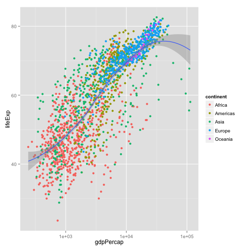 

---

#### Layer functions have options other than aesthetic mappings. These don't go in inside the aes() function


```r
p + geom_point(aes(color=continent)) +
    geom_smooth(color="darkgreen", se=FALSE, size=2, method="lm") +
    scale_x_log10()
```

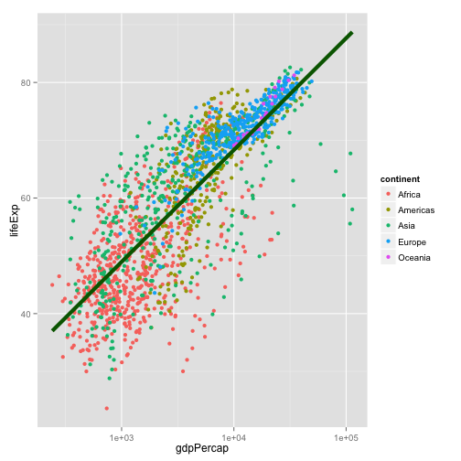 

---

#### First geoms, then scales, then labels, theme elements, and titles


```r
library(scales)

p + geom_point(aes(color=continent)) +
    geom_smooth(color="orange", method="loess", se=FALSE, size=2) +
    scale_x_log10(labels=comma) +
    labs(x="GDP per Capita",
         y="Life Expectancy",
         color="Continent") +
    theme(legend.position="bottom") +
    ggtitle("Broad Trends")
```

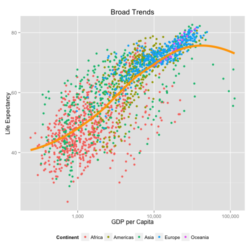 

---

#### When ggplot misbehaves or gives unexpected output, it is usually because the mapping you have specified is not what you need, or the variable is not appropriate to the aesthetic feature in some way 

---


```r
p <- ggplot(my.data,
            aes(x=gdpPercap, y=lifeExp))

p + geom_line() +
    scale_x_log10() 
```

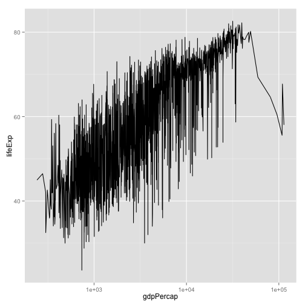 

- What's wrong with this picture?

---

##### Put year on the x-axis


```r
p <- ggplot(my.data,
            aes(x=year, y=lifeExp))
p + geom_line() +
    scale_x_log10() 
```

 

- Hmm, not much better
- Also, why are there no x labels for years?

---


##### Put year on the x-axis


```r
p <- ggplot(my.data,
            aes(x=year, y=lifeExp))
p + geom_line() 
```

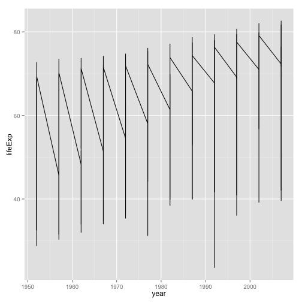 

- Fix the scale. 
- The plot is still meaningless, unfortunately

---


```r
p <- ggplot(my.data,
            aes(x=year, y=lifeExp))
p + geom_line(aes(group=country)) 
```

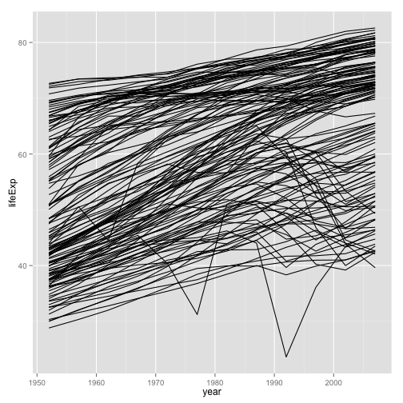 

- More promising

---


```r
p <- ggplot(my.data,
            aes(x=year, y=lifeExp))
p + geom_line(aes(group=country,
                  color=continent)) 
```

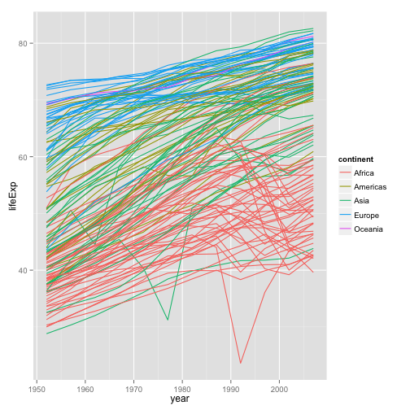 

- Better

---


### Let's just look at Asia


```r
p <- ggplot(my.data,
            aes(x=year, y=lifeExp))
p + geom_line(aes(group=country,
                  color=(continent=="Asia")))
```

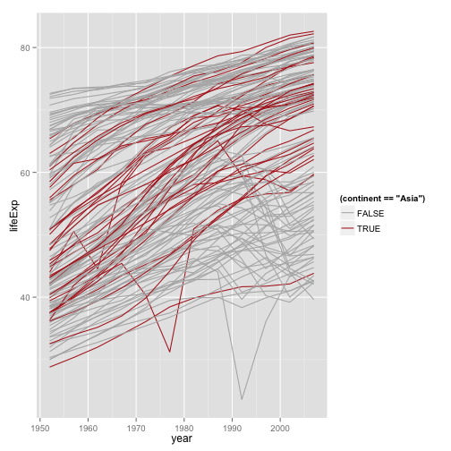 

---


### Better colors


```r
p <- ggplot(my.data,
            aes(x=year, y=lifeExp))
p + geom_line(aes(group=country,
                  color=(continent=="Asia"))) +
    scale_color_manual(values=c("gray70", "firebrick")) 
```

 

---

### Better Legend Labels


```r
p + geom_line(aes(group=country,
                  color=(continent=="Asia"))) +
    scale_color_manual(values=c("gray70", "firebrick"),
                       labels=c("All Other Countries", "Asian Countries")) +
    scale_x_log10() 
```

 

---


### Better Legend Title and Position


```r
p + geom_line(aes(group=country,
                  color=(continent=="Asia"))) +
    scale_color_manual(values=c("gray70", "firebrick"),
                       labels=c("All Other Countries", "Asian Countries")) +
    labs(color="Country") +
    theme(legend.position="top")
```

 

---


### Make the Salient category the first one


```r
p + geom_line(aes(group=country,
                  color=(continent=="Asia"))) +
    scale_color_manual(values=c("gray70", "firebrick"),
                       labels=c("All Other Countries", "Asian Countries")) +
    labs(color="Country") +
    theme(legend.position="top") +
    guides(color=guide_legend(reverse = TRUE))
```

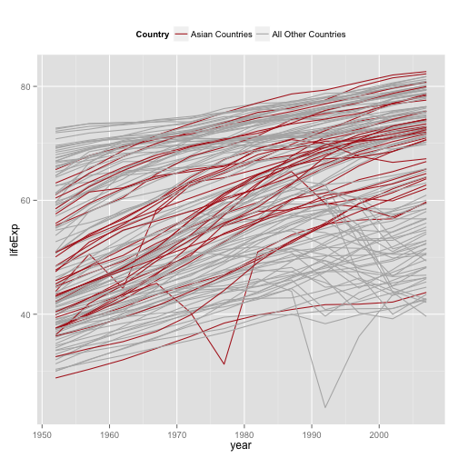 

---


### And add labels


```r
p + geom_line(aes(group=country,
                  color=(continent=="Asia"))) +
    scale_color_manual(values=c("gray70", "firebrick"),
                       labels=c("All Other Countries", "Asian Countries")) +
    labs(x="Year",
         y="Life Expectancy",
         color="Country") +
    theme(legend.position="top") +
    guides(color=guide_legend(reverse = TRUE))
```

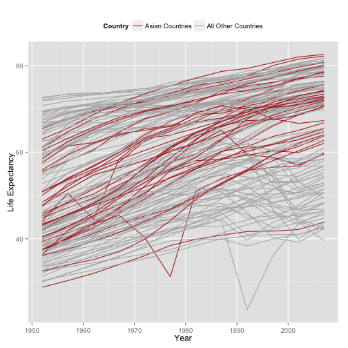 

- Still lots of room for improvement. E.g., note how the Asian trend lines are drawn under the gray ones. 

---

#### To see the logic behind each plot, peel each layer off from the last one to the first. See which parts of the plot change, or disappear. 

---

## A New Dataset


```r
organs.url <- "https://raw.githubusercontent.com/socviz/soc880/gh-pages/data/organ-procurement.csv"
organs.data <- read.csv(url(organs.url), row.names=1)
dim(organs.data)
```

```
## [1] 238  20
```

```r
head(organs.data)
```

```
##     country year donors   pop  pop.dens   gdp gdp.lag health health.lag
## 1 Australia   NA     NA 17065 0.2204433 16774   16591   1300       1224
## 2 Australia 1991  12.09 17284 0.2232723 17171   16774   1379       1300
## 3 Australia 1992  12.35 17495 0.2259980 17914   17171   1455       1379
## 4 Australia 1993  12.51 17667 0.2282198 18883   17914   1540       1455
## 5 Australia 1994  10.25 17855 0.2306484 19849   18883   1626       1540
## 6 Australia 1995  10.18 18072 0.2334516 21079   19849   1737       1626
##   pubhealth    roads cerebvas assault external   txp.pop   world opt
## 1       4.8 136.5954      682      21      444 0.9375916 Liberal  In
## 2       5.4 122.2518      647      19      425 0.9257116 Liberal  In
## 3       5.4 112.8322      630      17      406 0.9145470 Liberal  In
## 4       5.4 110.5451      611      18      376 0.9056433 Liberal  In
## 5       5.4 107.9810      631      17      387 0.8961075 Liberal  In
## 6       5.5 111.6091      592      16      371 0.8853475 Liberal  In
##   consent.law consent.practice consistent
## 1    Informed         Informed        Yes
## 2    Informed         Informed        Yes
## 3    Informed         Informed        Yes
## 4    Informed         Informed        Yes
## 5    Informed         Informed        Yes
## 6    Informed         Informed        Yes
```

```r
## For convenience, let R know year is a time measure.
organs.data$year <- ad.Date(strptime(organs.data$year, format="%Y"))
```

```
## Error in eval(expr, envir, enclos): could not find function "ad.Date"
```


---

### Similar country-year structure to before

- Before looking at the next few slides, what can you get out of this dataset?
- Try examining it and making a few plots

---


```r
p <- ggplot(data=organs.data,
            aes(x=as.Date(year),
                y=donors))
```


---

```r
p + geom_line(aes(group=country,
                  color=consent.law)) +
    scale_color_manual(values=c("gray40", "firebrick")) +
    scale_x_date() + 
    labs(x="Year",
         y="Donors",
         color="Consent Law") +
    theme(legend.position="top")
```

```
## Error in as.Date.numeric(year): 'origin' must be supplied
```

---


```r
p + geom_line(aes(group=country)) +
    labs(x="Year",
         y="Donors") +
    facet_grid(~consent.law)
```

```
## Error in as.Date.numeric(year): 'origin' must be supplied
```

---

## A quick bit of data manipulation


```r
library(magrittr)
library(dplyr)


by.country <- organs.data %>% group_by(consent.law, country) %>%
    summarize(donors=mean(donors, na.rm = TRUE))


by.country
```

```
## Source: local data frame [17 x 3]
## Groups: consent.law [?]
## 
##    consent.law        country   donors
##         (fctr)         (fctr)    (dbl)
## 1     Informed      Australia 10.63500
## 2     Informed         Canada 13.96667
## 3     Informed        Denmark 13.09167
## 4     Informed        Germany 13.04167
## 5     Informed        Ireland 19.79167
## 6     Informed    Netherlands 13.65833
## 7     Informed United Kingdom 13.49167
## 8     Informed  United States 19.98167
## 9     Presumed        Austria 23.52500
## 10    Presumed        Belgium 21.90000
## 11    Presumed        Finland 18.44167
## 12    Presumed         France 16.75833
## 13    Presumed          Italy 11.10000
## 14    Presumed         Norway 15.44167
## 15    Presumed          Spain 28.10833
## 16    Presumed         Sweden 13.12500
## 17    Presumed    Switzerland 14.18250
```

---


```r
p <- ggplot(by.country, aes(x=donors, y=country, color=consent.law))
p + geom_point(size=3)
```

 

- How can we improve this?

---


```r
p <- ggplot(by.country, aes(x=donors, y=reorder(country, donors), color=consent.law))
p + geom_point(size=3)
```

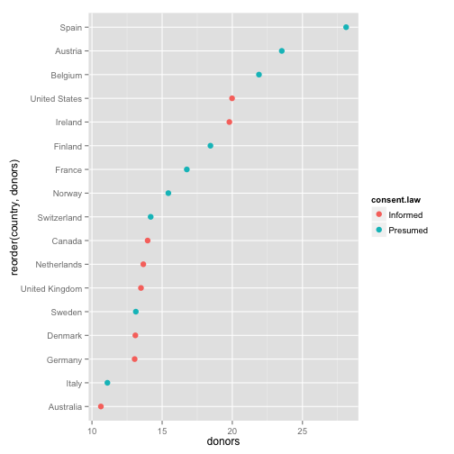 

- Get your factors (the categorical variable) in order

---


```r
p + geom_point(size=3) +
    labs(x="Donor Procurement Rate (per million population)",
         y="",
         color="Consent Law") +
    theme(legend.position="top")
```

 

---

## Alternatively 


```r
p <- ggplot(by.country, aes(x=donors, y=reorder(country, donors)))
p + geom_point(size=3) +
    facet_grid(consent.law ~ ., scales="free") +
    labs(x="Donor Procurement Rate (per million population)",
         y="",
         color="Consent Law") +
    theme(legend.position="top")
```

 

---

#### Cleveland Dotplots of this sort are a very useful way of summarizing 1-D data that comes in categories

- Consider them in preference to bar or column charts
- Keeping the categories on the y-axis is often a good idea
- The principle extends to 1-D summaries of distributions
- They are also an excellent way to summarize model results with error ranges 

---

#### Summary Boxplots


```r
p <- ggplot(data=organs.data,
            aes(x=country,
                y=donors)) 


p + geom_boxplot() +
    coord_flip() +
    labs(x="",
         y="Donor Procurement Rate")
```

```
## Warning: Removed 34 rows containing non-finite values (stat_boxplot).
```

 

---

#### Summary Boxplots


```r
p <- ggplot(data=organs.data,
            aes(x=reorder(country, donors, na.rm=TRUE),
                y=donors)) 


p + geom_boxplot() +
    coord_flip() +
    labs(x="",
         y="Donor Procurement Rate")
```

```
## Warning: Removed 34 rows containing non-finite values (stat_boxplot).
```

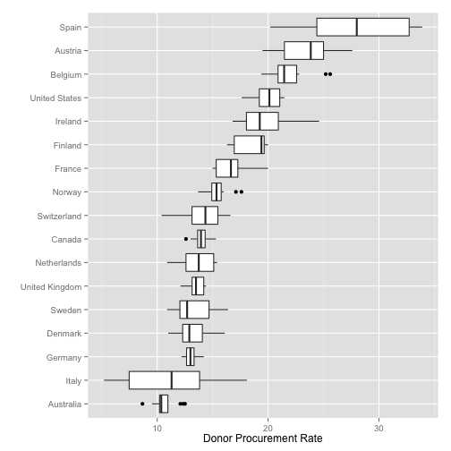 

---

#### Summary Boxplots


```r
p <- ggplot(data=organs.data,
            aes(x=reorder(country, donors, na.rm=TRUE),
                y=donors)) 


p + geom_boxplot(aes(fill=consent.law)) +
    coord_flip() +
    labs(x="",
         y="Donor Procurement Rate")
```

```
## Warning: Removed 34 rows containing non-finite values (stat_boxplot).
```

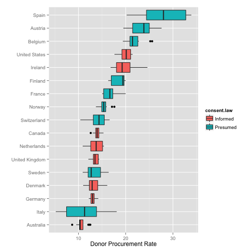 


---

#### 1-D point summaries


```r
p <- ggplot(data=organs.data,
            aes(x=reorder(country, donors, na.rm=TRUE),
                y=donors)) 


p + geom_point(aes(color=consent.law)) +
    coord_flip() +
    labs(x="",
         y="Donor Procurement Rate")
```

```
## Warning: Removed 34 rows containing missing values (geom_point).
```

 

---

#### Add a little jitter


```r
p <- ggplot(data=organs.data,
            aes(x=reorder(country, donors, na.rm=TRUE),
                y=donors)) 


p + geom_jitter(aes(color=consent.law)) +
    coord_flip() +
    labs(x="",
         y="Donor Procurement Rate")
```

```
## Warning: Removed 34 rows containing missing values (geom_point).
```

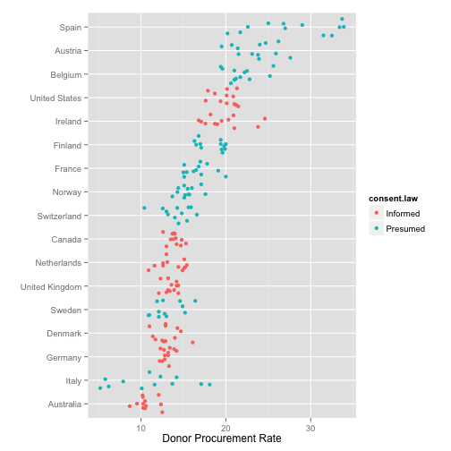 

---


---

#### Fine-tune the jittering


```r
p <- ggplot(data=organs.data,
            aes(x=reorder(country, donors, na.rm=TRUE),
                y=donors)) 


p + geom_jitter(aes(color=consent.law),
                position = position_jitter(width=0.2)) +
    coord_flip() +
    labs(x="",
         y="Donor Procurement Rate",
         color="Consent Law") +
    theme(legend.position="top")
```

```
## Warning: Removed 34 rows containing missing values (geom_point).
```

 

---


