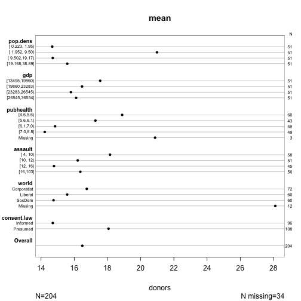
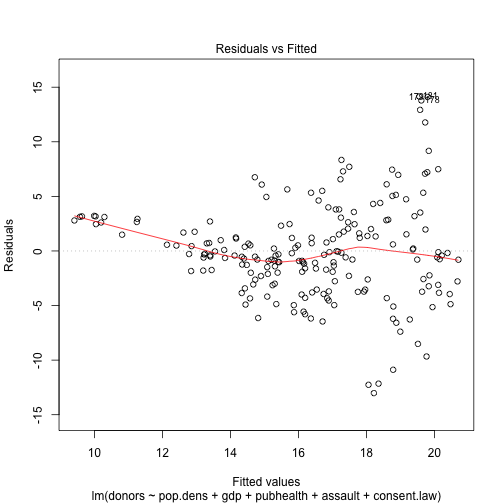
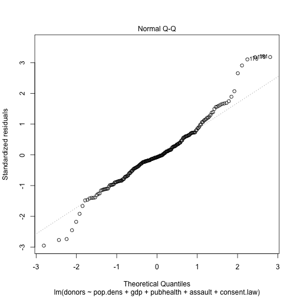
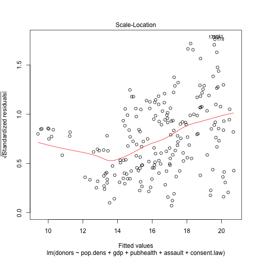
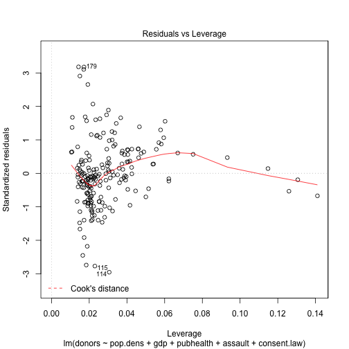
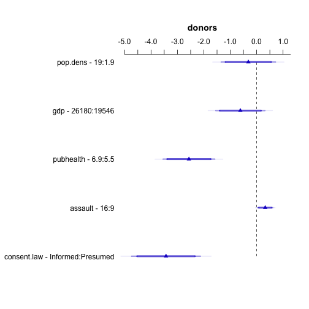
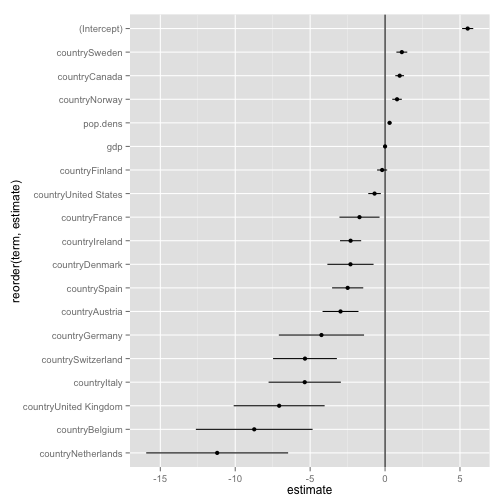

<style type='text/css'>
.reveal {
  font-size: 28px;  
}
</style>


# Data and Models

## Data Visualization, Week 4

### Kieran Healy, Duke University

---

## Outline for Today

0. Housekeeping
1. Pairs Plots
2. Looking at Data while Modeling
3. `broom`
4. A (curse) word about Git
5. The NZ Electorate data

--- 

## How to Navigate these Slides

- When you view them online, notice the compass in the bottom right corner
- You can go left or right, or sometimes down to more detail.
- Hit the `Escape` key to get an overview of all the slides. On a phone
  or tablet, pinch to get the slide overview.
- You can use the arrow keys (or swipe up and down) in this view, as well. 
- Hit `Escape` again to return to the slide you were looking at. 
- On a phone or tablet, tap the slide you want.

---


## Organs Data


```r
organs.url <- "https://raw.githubusercontent.com/socviz/soc880/gh-pages/data/organ-procurement.csv"
organs.data <- read.csv(url(organs.url), row.names=1)
dim(organs.data)
```

```
## [1] 238  20
```

```r
head(organs.data)
```

```
##     country year donors   pop pop.dens   gdp gdp.lag health health.lag
## 1 Australia   NA     NA 17065     0.22 16774   16591   1300       1224
## 2 Australia 1991     12 17284     0.22 17171   16774   1379       1300
## 3 Australia 1992     12 17495     0.23 17914   17171   1455       1379
## 4 Australia 1993     13 17667     0.23 18883   17914   1540       1455
## 5 Australia 1994     10 17855     0.23 19849   18883   1626       1540
## 6 Australia 1995     10 18072     0.23 21079   19849   1737       1626
##   pubhealth roads cerebvas assault external txp.pop   world opt
## 1       4.8   137      682      21      444    0.94 Liberal  In
## 2       5.4   122      647      19      425    0.93 Liberal  In
## 3       5.4   113      630      17      406    0.91 Liberal  In
## 4       5.4   111      611      18      376    0.91 Liberal  In
## 5       5.4   108      631      17      387    0.90 Liberal  In
## 6       5.5   112      592      16      371    0.89 Liberal  In
##   consent.law consent.practice consistent
## 1    Informed         Informed        Yes
## 2    Informed         Informed        Yes
## 3    Informed         Informed        Yes
## 4    Informed         Informed        Yes
## 5    Informed         Informed        Yes
## 6    Informed         Informed        Yes
```

```r
## For convenience, let R know year is a time measure.
organs.data$year <- as.Date(strptime(organs.data$year, format="%Y"))
```

---

## Pairs Plot


```r
## install.packages("GGally")
library(GGally)

my.vars <- c("donors", "pop", "gdp",
             "pubhealth", "assault")

pdf(file="../figures/ggpairs-plot-1.pdf", height=15, width=15)
p <- ggpairs(subset(organs.data, select=my.vars),
        upper=list(continuous="smooth"),
        lower=list(continuous="points"))
print(p)
```

```
## Warning: Removed 34 rows containing non-finite values (stat_density).
```

```
## Warning: Removed 34 rows containing missing values (stat_smooth).
```

```
## Warning: Removed 34 rows containing missing values (geom_point).
```

```
## Warning: Removed 34 rows containing missing values (stat_smooth).
```

```
## Warning: Removed 34 rows containing missing values (geom_point).
```

```
## Warning: Removed 37 rows containing missing values (stat_smooth).
```

```
## Warning: Removed 37 rows containing missing values (geom_point).
```

```
## Warning: Removed 34 rows containing missing values (stat_smooth).
```

```
## Warning: Removed 34 rows containing missing values (geom_point).
```

```
## Warning: Removed 34 rows containing missing values (geom_point).
```

```
## Warning: Removed 17 rows containing non-finite values (stat_density).
```

```
## Warning: Removed 17 rows containing missing values (stat_smooth).
```

```
## Warning: Removed 17 rows containing missing values (geom_point).
```

```
## Warning: Removed 21 rows containing missing values (stat_smooth).
```

```
## Warning: Removed 21 rows containing missing values (geom_point).
```

```
## Warning: Removed 17 rows containing missing values (stat_smooth).
```

```
## Warning: Removed 17 rows containing missing values (geom_point).
```

```
## Warning: Removed 34 rows containing missing values (geom_point).
```

```
## Warning: Removed 17 rows containing missing values (geom_point).
```

```
## Warning: Removed 17 rows containing non-finite values (stat_density).
```

```
## Warning: Removed 21 rows containing missing values (stat_smooth).
```

```
## Warning: Removed 21 rows containing missing values (geom_point).
```

```
## Warning: Removed 17 rows containing missing values (stat_smooth).
```

```
## Warning: Removed 17 rows containing missing values (geom_point).
```

```
## Warning: Removed 37 rows containing missing values (geom_point).
```

```
## Warning: Removed 21 rows containing missing values (geom_point).
```

```
## Warning: Removed 21 rows containing missing values (geom_point).
```

```
## Warning: Removed 21 rows containing non-finite values (stat_density).
```

```
## Warning: Removed 21 rows containing missing values (stat_smooth).
```

```
## Warning: Removed 21 rows containing missing values (geom_point).
```

```
## Warning: Removed 34 rows containing missing values (geom_point).
```

```
## Warning: Removed 17 rows containing missing values (geom_point).
```

```
## Warning: Removed 17 rows containing missing values (geom_point).
```

```
## Warning: Removed 21 rows containing missing values (geom_point).
```

```
## Warning: Removed 17 rows containing non-finite values (stat_density).
```

```r
dev.off()
```

```
## quartz 
##      2
```

---

## Generalized Pairs Plots 


```r
my.vars <- c("donors", "pop.dens", "gdp",
             "pubhealth", "world", "consent.law",
             "assault", "opt")

pdf(file="../figures/ggpairs-plot-2.pdf", height=20, width=20)
p <- ggpairs(subset(organs.data, select=my.vars),
        upper=list(continuous="smooth", combo="box"),
        lower=list(continuous="points", combo="dot"))
print(p)
```

```
## Warning: Removed 34 rows containing non-finite values (stat_density).
```

```
## Warning: Removed 34 rows containing missing values (stat_smooth).
```

```
## Warning: Removed 34 rows containing missing values (geom_point).
```

```
## Warning: Removed 34 rows containing missing values (stat_smooth).
```

```
## Warning: Removed 34 rows containing missing values (geom_point).
```

```
## Warning: Removed 37 rows containing missing values (stat_smooth).
```

```
## Warning: Removed 37 rows containing missing values (geom_point).
```

```
## Warning: Removed 12 rows containing non-finite values (stat_boxplot).
```

```
## Warning: Removed 10 rows containing non-finite values (stat_boxplot).
```

```
## Warning: Removed 10 rows containing non-finite values (stat_boxplot).
```

```
## Warning: Removed 2 rows containing non-finite values (stat_boxplot).
```

```
## Warning: Removed 16 rows containing non-finite values (stat_boxplot).
```

```
## Warning: Removed 18 rows containing non-finite values (stat_boxplot).
```

```
## Warning: Removed 34 rows containing missing values (stat_smooth).
```

```
## Warning: Removed 34 rows containing missing values (geom_point).
```

```
## Warning: Removed 18 rows containing non-finite values (stat_boxplot).
```

```
## Warning: Removed 12 rows containing non-finite values (stat_boxplot).
```

```
## Warning: Removed 4 rows containing non-finite values (stat_boxplot).
```

```
## Warning: Removed 34 rows containing missing values (geom_point).
```

```
## Warning: Removed 17 rows containing non-finite values (stat_density).
```

```
## Warning: Removed 17 rows containing missing values (stat_smooth).
```

```
## Warning: Removed 17 rows containing missing values (geom_point).
```

```
## Warning: Removed 21 rows containing missing values (stat_smooth).
```

```
## Warning: Removed 21 rows containing missing values (geom_point).
```

```
## Warning: Removed 6 rows containing non-finite values (stat_boxplot).
```

```
## Warning: Removed 5 rows containing non-finite values (stat_boxplot).
```

```
## Warning: Removed 5 rows containing non-finite values (stat_boxplot).
```

```
## Warning: Removed 1 rows containing non-finite values (stat_boxplot).
```

```
## Warning: Removed 8 rows containing non-finite values (stat_boxplot).
```

```
## Warning: Removed 9 rows containing non-finite values (stat_boxplot).
```

```
## Warning: Removed 17 rows containing missing values (stat_smooth).
```

```
## Warning: Removed 17 rows containing missing values (geom_point).
```

```
## Warning: Removed 9 rows containing non-finite values (stat_boxplot).
```

```
## Warning: Removed 6 rows containing non-finite values (stat_boxplot).
```

```
## Warning: Removed 2 rows containing non-finite values (stat_boxplot).
```

```
## Warning: Removed 34 rows containing missing values (geom_point).
```

```
## Warning: Removed 17 rows containing missing values (geom_point).
```

```
## Warning: Removed 17 rows containing non-finite values (stat_density).
```

```
## Warning: Removed 21 rows containing missing values (stat_smooth).
```

```
## Warning: Removed 21 rows containing missing values (geom_point).
```

```
## Warning: Removed 6 rows containing non-finite values (stat_boxplot).
```

```
## Warning: Removed 5 rows containing non-finite values (stat_boxplot).
```

```
## Warning: Removed 5 rows containing non-finite values (stat_boxplot).
```

```
## Warning: Removed 1 rows containing non-finite values (stat_boxplot).
```

```
## Warning: Removed 8 rows containing non-finite values (stat_boxplot).
```

```
## Warning: Removed 9 rows containing non-finite values (stat_boxplot).
```

```
## Warning: Removed 17 rows containing missing values (stat_smooth).
```

```
## Warning: Removed 17 rows containing missing values (geom_point).
```

```
## Warning: Removed 9 rows containing non-finite values (stat_boxplot).
```

```
## Warning: Removed 6 rows containing non-finite values (stat_boxplot).
```

```
## Warning: Removed 2 rows containing non-finite values (stat_boxplot).
```

```
## Warning: Removed 37 rows containing missing values (geom_point).
```

```
## Warning: Removed 21 rows containing missing values (geom_point).
```

```
## Warning: Removed 21 rows containing missing values (geom_point).
```

```
## Warning: Removed 21 rows containing non-finite values (stat_density).
```

```
## Warning: Removed 10 rows containing non-finite values (stat_boxplot).
```

```
## Warning: Removed 5 rows containing non-finite values (stat_boxplot).
```

```
## Warning: Removed 5 rows containing non-finite values (stat_boxplot).
```

```
## Warning: Removed 1 rows containing non-finite values (stat_boxplot).
```

```
## Warning: Removed 8 rows containing non-finite values (stat_boxplot).
```

```
## Warning: Removed 13 rows containing non-finite values (stat_boxplot).
```

```
## Warning: Removed 21 rows containing missing values (stat_smooth).
```

```
## Warning: Removed 21 rows containing missing values (geom_point).
```

```
## Warning: Removed 9 rows containing non-finite values (stat_boxplot).
```

```
## Warning: Removed 10 rows containing non-finite values (stat_boxplot).
```

```
## Warning: Removed 2 rows containing non-finite values (stat_boxplot).
```

```
## Warning: Removed 12 rows containing missing values (geom_point).
```

```
## Warning: Removed 10 rows containing missing values (geom_point).
```

```
## Warning: Removed 10 rows containing missing values (geom_point).
```

```
## Warning: Removed 2 rows containing missing values (geom_point).
```

```
## Warning: Removed 6 rows containing missing values (geom_point).
```

```
## Warning: Removed 5 rows containing missing values (geom_point).
```

```
## Warning: Removed 5 rows containing missing values (geom_point).
```

```
## Warning: Removed 1 rows containing missing values (geom_point).
```

```
## Warning: Removed 6 rows containing missing values (geom_point).
```

```
## Warning: Removed 5 rows containing missing values (geom_point).
```

```
## Warning: Removed 5 rows containing missing values (geom_point).
```

```
## Warning: Removed 1 rows containing missing values (geom_point).
```

```
## Warning: Removed 10 rows containing missing values (geom_point).
```

```
## Warning: Removed 5 rows containing missing values (geom_point).
```

```
## Warning: Removed 5 rows containing missing values (geom_point).
```

```
## Warning: Removed 1 rows containing missing values (geom_point).
```

```
## Warning: Removed 6 rows containing non-finite values (stat_boxplot).
```

```
## Warning: Removed 5 rows containing non-finite values (stat_boxplot).
```

```
## Warning: Removed 5 rows containing non-finite values (stat_boxplot).
```

```
## Warning: Removed 1 rows containing non-finite values (stat_boxplot).
```

```
## Warning: Removed 16 rows containing missing values (geom_point).
```

```
## Warning: Removed 18 rows containing missing values (geom_point).
```

```
## Warning: Removed 8 rows containing missing values (geom_point).
```

```
## Warning: Removed 9 rows containing missing values (geom_point).
```

```
## Warning: Removed 8 rows containing missing values (geom_point).
```

```
## Warning: Removed 9 rows containing missing values (geom_point).
```

```
## Warning: Removed 8 rows containing missing values (geom_point).
```

```
## Warning: Removed 13 rows containing missing values (geom_point).
```

```
## Warning: Removed 8 rows containing non-finite values (stat_boxplot).
```

```
## Warning: Removed 9 rows containing non-finite values (stat_boxplot).
```

```
## Warning: Removed 34 rows containing missing values (geom_point).
```

```
## Warning: Removed 17 rows containing missing values (geom_point).
```

```
## Warning: Removed 17 rows containing missing values (geom_point).
```

```
## Warning: Removed 21 rows containing missing values (geom_point).
```

```
## Warning: Removed 6 rows containing missing values (geom_point).
```

```
## Warning: Removed 5 rows containing missing values (geom_point).
```

```
## Warning: Removed 5 rows containing missing values (geom_point).
```

```
## Warning: Removed 1 rows containing missing values (geom_point).
```

```
## Warning: Removed 8 rows containing missing values (geom_point).
```

```
## Warning: Removed 9 rows containing missing values (geom_point).
```

```
## Warning: Removed 17 rows containing non-finite values (stat_density).
```

```
## Warning: Removed 9 rows containing non-finite values (stat_boxplot).
```

```
## Warning: Removed 6 rows containing non-finite values (stat_boxplot).
```

```
## Warning: Removed 2 rows containing non-finite values (stat_boxplot).
```

```
## Warning: Removed 18 rows containing missing values (geom_point).
```

```
## Warning: Removed 12 rows containing missing values (geom_point).
```

```
## Warning: Removed 4 rows containing missing values (geom_point).
```

```
## Warning: Removed 9 rows containing missing values (geom_point).
```

```
## Warning: Removed 6 rows containing missing values (geom_point).
```

```
## Warning: Removed 2 rows containing missing values (geom_point).
```

```
## Warning: Removed 9 rows containing missing values (geom_point).
```

```
## Warning: Removed 6 rows containing missing values (geom_point).
```

```
## Warning: Removed 2 rows containing missing values (geom_point).
```

```
## Warning: Removed 9 rows containing missing values (geom_point).
```

```
## Warning: Removed 10 rows containing missing values (geom_point).
```

```
## Warning: Removed 2 rows containing missing values (geom_point).
```

```
## Warning: Removed 9 rows containing missing values (geom_point).
```

```
## Warning: Removed 6 rows containing missing values (geom_point).
```

```
## Warning: Removed 2 rows containing missing values (geom_point).
```

```r
dev.off()
```

```
## quartz 
##      2
```

---

## Looking While Modeling

- Frank Harrell, *Regression Modeling Strategies* (Springer 2001) is an older text, but the visualization principles are good. Two of his useful software libraries for R are `Hmisc` and `rms`.


```r
### install.packages("Hmisc")
### install.packages("rms")

library(Hmisc)
library(rms)

vc <- varclus(~ donors + pop.dens + gdp + pubhealth + assault + world + consent.law,
              data=organs.data)
plot(vc)
```

 

---


```r
plot(naclus(organs.data))
```

 

---


```r
s <- summary(donors ~ pop.dens + gdp + pubhealth + assault + world + consent.law,
              data=organs.data)

plot(s, cex.labels = 0.6)
```

 

---

## Diagnostic Plots for a Poorly-Specified Model


```r
out.lm <- lm(donors ~ pop.dens + gdp + pubhealth + assault + consent.law,
             data=organs.data)

summary(out.lm)
```

```
## 
## Call:
## lm(formula = donors ~ pop.dens + gdp + pubhealth + assault + 
##     consent.law, data = organs.data)
## 
## Residuals:
##     Min      1Q  Median      3Q     Max 
## -13.019  -2.607  -0.323   2.457  14.146 
## 
## Coefficients:
##                      Estimate Std. Error t value Pr(>|t|)    
## (Intercept)          2.77e+01   2.77e+00    9.98  < 2e-16 ***
## pop.dens            -1.83e-02   3.05e-02   -0.60    0.549    
## gdp                 -9.31e-05   7.13e-05   -1.31    0.193    
## pubhealth           -1.83e+00   3.56e-01   -5.14  6.6e-07 ***
## assault              4.63e-02   2.06e-02    2.25    0.026 *  
## consent.lawPresumed  3.43e+00   6.63e-01    5.18  5.5e-07 ***
## ---
## Signif. codes:  0 '***' 0.001 '**' 0.01 '*' 0.05 '.' 0.1 ' ' 1
## 
## Residual standard error: 4.5 on 195 degrees of freedom
##   (37 observations deleted due to missingness)
## Multiple R-squared:  0.255,	Adjusted R-squared:  0.235 
## F-statistic: 13.3 on 5 and 195 DF,  p-value: 3.59e-11
```

---


```r
plot(out.lm, which=1)
```

 

---


```r
plot(out.lm, which=2)
```

 


---


```r
plot(out.lm, which=3)
```

 

---


```r
plot(out.lm, which=5)
```

 

---

### Plotting results with Hmisc


```r
## NB
out.ols <- ols(donors ~ pop.dens + gdp + pubhealth + assault + consent.law,
             data=organs.data)

d <- datadist(organs.data)
options(datadist="d")
options(digits = 2)

plot(summary(out.ols))
```

 

---

## Tidy Model Output with `broom`


```r
## install.packages("broom")

library(broom)

## more irresponsible model
out.lm <- lm(pubhealth ~ pop.dens + gdp + country,
             data=organs.data)

summary(out.lm)
```

```
## 
## Call:
## lm(formula = pubhealth ~ pop.dens + gdp + country, data = organs.data)
## 
## Residuals:
##     Min      1Q  Median      3Q     Max 
## -0.9899 -0.2095 -0.0229  0.2115  1.4625 
## 
## Coefficients:
##                        Estimate Std. Error t value Pr(>|t|)    
## (Intercept)            5.51e+00   1.88e-01   29.27  < 2e-16 ***
## pop.dens               3.02e-01   6.45e-02    4.68  5.4e-06 ***
## gdp                    4.09e-06   7.31e-06    0.56   0.5762    
## countryAustria        -2.97e+00   6.08e-01   -4.89  2.1e-06 ***
## countryBelgium        -8.73e+00   1.98e+00   -4.42  1.6e-05 ***
## countryCanada          9.76e-01   1.48e-01    6.59  3.8e-10 ***
## countryDenmark        -2.31e+00   7.81e-01   -2.95   0.0035 ** 
## countryFinland        -1.95e-01   1.71e-01   -1.14   0.2539    
## countryFrance         -1.71e+00   6.79e-01   -2.51   0.0127 *  
## countryGermany        -4.25e+00   1.44e+00   -2.94   0.0036 ** 
## countryIreland        -2.30e+00   3.58e-01   -6.43  9.4e-10 ***
## countryItaly          -5.36e+00   1.22e+00   -4.38  1.9e-05 ***
## countryNetherlands    -1.12e+01   2.40e+00   -4.67  5.7e-06 ***
## countryNorway          7.99e-01   1.62e-01    4.94  1.7e-06 ***
## countrySpain          -2.50e+00   5.28e-01   -4.73  4.3e-06 ***
## countrySweden          1.12e+00   1.84e-01    6.08  6.1e-09 ***
## countrySwitzerland    -5.35e+00   1.08e+00   -4.95  1.6e-06 ***
## countryUnited Kingdom -7.07e+00   1.54e+00   -4.59  7.8e-06 ***
## countryUnited States  -7.01e-01   2.12e-01   -3.30   0.0011 ** 
## ---
## Signif. codes:  0 '***' 0.001 '**' 0.01 '*' 0.05 '.' 0.1 ' ' 1
## 
## Residual standard error: 0.38 on 198 degrees of freedom
##   (21 observations deleted due to missingness)
## Multiple R-squared:  0.846,	Adjusted R-squared:  0.831 
## F-statistic: 60.2 on 18 and 198 DF,  p-value: <2e-16
```

---

### Model objects have a lot of information in them


```r
str(out.lm)
```

```
## List of 14
##  $ coefficients : Named num [1:19] 5.51 3.02e-01 4.09e-06 -2.97 -8.73 ...
##   ..- attr(*, "names")= chr [1:19] "(Intercept)" "pop.dens" "gdp" "countryAustria" ...
##  $ residuals    : Named num [1:217] -0.85 -0.252 -0.256 -0.261 -0.266 ...
##   ..- attr(*, "names")= chr [1:217] "1" "2" "3" "4" ...
##  $ effects      : Named num [1:217] -91.179 0.0453 1.4467 -2.6589 0.2062 ...
##   ..- attr(*, "names")= chr [1:217] "(Intercept)" "pop.dens" "gdp" "countryAustria" ...
##  $ rank         : int 19
##  $ fitted.values: Named num [1:217] 5.65 5.65 5.66 5.66 5.67 ...
##   ..- attr(*, "names")= chr [1:217] "1" "2" "3" "4" ...
##  $ assign       : int [1:19] 0 1 2 3 3 3 3 3 3 3 ...
##  $ qr           :List of 5
##   ..$ qr   : num [1:217, 1:19] -14.7309 0.0679 0.0679 0.0679 0.0679 ...
##   .. ..- attr(*, "dimnames")=List of 2
##   .. .. ..$ : chr [1:217] "1" "2" "3" "4" ...
##   .. .. ..$ : chr [1:19] "(Intercept)" "pop.dens" "gdp" "countryAustria" ...
##   .. ..- attr(*, "assign")= int [1:19] 0 1 2 3 3 3 3 3 3 3 ...
##   .. ..- attr(*, "contrasts")=List of 1
##   .. .. ..$ country: chr "contr.treatment"
##   ..$ qraux: num [1:19] 1.07 1.07 1.07 1.02 1.01 ...
##   ..$ pivot: int [1:19] 1 2 3 4 5 6 7 8 9 10 ...
##   ..$ tol  : num 1e-07
##   ..$ rank : int 19
##   ..- attr(*, "class")= chr "qr"
##  $ df.residual  : int 198
##  $ na.action    :Class 'omit'  Named int [1:21] 14 28 29 30 31 32 42 56 70 84 ...
##   .. ..- attr(*, "names")= chr [1:21] "14" "28" "29" "30" ...
##  $ contrasts    :List of 1
##   ..$ country: chr "contr.treatment"
##  $ xlevels      :List of 1
##   ..$ country: chr [1:17] "Australia" "Austria" "Belgium" "Canada" ...
##  $ call         : language lm(formula = pubhealth ~ pop.dens + gdp + country, data = organs.data)
##  $ terms        :Classes 'terms', 'formula' length 3 pubhealth ~ pop.dens + gdp + country
##   .. ..- attr(*, "variables")= language list(pubhealth, pop.dens, gdp, country)
##   .. ..- attr(*, "factors")= int [1:4, 1:3] 0 1 0 0 0 0 1 0 0 0 ...
##   .. .. ..- attr(*, "dimnames")=List of 2
##   .. .. .. ..$ : chr [1:4] "pubhealth" "pop.dens" "gdp" "country"
##   .. .. .. ..$ : chr [1:3] "pop.dens" "gdp" "country"
##   .. ..- attr(*, "term.labels")= chr [1:3] "pop.dens" "gdp" "country"
##   .. ..- attr(*, "order")= int [1:3] 1 1 1
##   .. ..- attr(*, "intercept")= int 1
##   .. ..- attr(*, "response")= int 1
##   .. ..- attr(*, ".Environment")=<environment: R_GlobalEnv> 
##   .. ..- attr(*, "predvars")= language list(pubhealth, pop.dens, gdp, country)
##   .. ..- attr(*, "dataClasses")= Named chr [1:4] "numeric" "numeric" "numeric" "factor"
##   .. .. ..- attr(*, "names")= chr [1:4] "pubhealth" "pop.dens" "gdp" "country"
##  $ model        :'data.frame':	217 obs. of  4 variables:
##   ..$ pubhealth: num [1:217] 4.8 5.4 5.4 5.4 5.4 5.5 5.6 5.7 5.9 6.1 ...
##   ..$ pop.dens : num [1:217] 0.22 0.223 0.226 0.228 0.231 ...
##   ..$ gdp      : int [1:217] 16774 17171 17914 18883 19849 21079 21923 22961 24148 25445 ...
##   ..$ country  : Factor w/ 17 levels "Australia","Austria",..: 1 1 1 1 1 1 1 1 1 1 ...
##   ..- attr(*, "terms")=Classes 'terms', 'formula' length 3 pubhealth ~ pop.dens + gdp + country
##   .. .. ..- attr(*, "variables")= language list(pubhealth, pop.dens, gdp, country)
##   .. .. ..- attr(*, "factors")= int [1:4, 1:3] 0 1 0 0 0 0 1 0 0 0 ...
##   .. .. .. ..- attr(*, "dimnames")=List of 2
##   .. .. .. .. ..$ : chr [1:4] "pubhealth" "pop.dens" "gdp" "country"
##   .. .. .. .. ..$ : chr [1:3] "pop.dens" "gdp" "country"
##   .. .. ..- attr(*, "term.labels")= chr [1:3] "pop.dens" "gdp" "country"
##   .. .. ..- attr(*, "order")= int [1:3] 1 1 1
##   .. .. ..- attr(*, "intercept")= int 1
##   .. .. ..- attr(*, "response")= int 1
##   .. .. ..- attr(*, ".Environment")=<environment: R_GlobalEnv> 
##   .. .. ..- attr(*, "predvars")= language list(pubhealth, pop.dens, gdp, country)
##   .. .. ..- attr(*, "dataClasses")= Named chr [1:4] "numeric" "numeric" "numeric" "factor"
##   .. .. .. ..- attr(*, "names")= chr [1:4] "pubhealth" "pop.dens" "gdp" "country"
##   ..- attr(*, "na.action")=Class 'omit'  Named int [1:21] 14 28 29 30 31 32 42 56 70 84 ...
##   .. .. ..- attr(*, "names")= chr [1:21] "14" "28" "29" "30" ...
##  - attr(*, "class")= chr "lm"
```

---

### `broom` turns summary model output into data frames


```r
out.tidy <- tidy(out.lm, conf.int = TRUE)
class(out.tidy)
```

```
## [1] "data.frame"
```

```r
head(out.tidy)
```

```
##             term estimate std.error statistic p.value conf.low conf.high
## 1    (Intercept)  5.5e+00   1.9e-01     29.27 7.5e-74  5.1e+00   5.9e+00
## 2       pop.dens  3.0e-01   6.5e-02      4.68 5.4e-06  1.7e-01   4.3e-01
## 3            gdp  4.1e-06   7.3e-06      0.56 5.8e-01 -1.0e-05   1.9e-05
## 4 countryAustria -3.0e+00   6.1e-01     -4.89 2.1e-06 -4.2e+00  -1.8e+00
## 5 countryBelgium -8.7e+00   2.0e+00     -4.42 1.6e-05 -1.3e+01  -4.8e+00
## 6  countryCanada  9.8e-01   1.5e-01      6.59 3.8e-10  6.8e-01   1.3e+00
```

---

### It will also "augment" data frames


```r
out.aug <- augment(out.lm)
head(out.aug)
```

```
##   .rownames pubhealth pop.dens   gdp   country .fitted .se.fit .resid
## 1         1       4.8     0.22 16774 Australia     5.6    0.11  -0.85
## 2         2       5.4     0.22 17171 Australia     5.7    0.11  -0.25
## 3         3       5.4     0.23 17914 Australia     5.7    0.11  -0.26
## 4         4       5.4     0.23 18883 Australia     5.7    0.11  -0.26
## 5         5       5.4     0.23 19849 Australia     5.7    0.11  -0.27
## 6         6       5.5     0.23 21079 Australia     5.7    0.10  -0.17
##    .hat .sigma .cooksd .std.resid
## 1 0.088   0.37 0.02830      -2.36
## 2 0.086   0.38 0.00244      -0.70
## 3 0.084   0.38 0.00243      -0.71
## 4 0.081   0.38 0.00242      -0.72
## 5 0.079   0.38 0.00244      -0.74
## 6 0.077   0.38 0.00099      -0.47
```

---

### Tidy output is easy to quickly plot


```r
p <- ggplot(out.tidy, aes(y=estimate,
                          x=reorder(term, estimate)))
p + geom_pointrange(aes(ymin=conf.low,
                        ymax=conf.high)) +
    geom_hline() +
    coord_flip()
```

 

---

### Tidiers are available for many packages


```r
library(survival)

out.surv <- survfit(coxph(Surv(time, status) ~ age + sex, data=lung))

out.tidy <- tidy(out.surv)

p <- ggplot(out.tidy, aes(time, estimate))

p + geom_line() +
    geom_ribbon(aes(ymin = conf.low, ymax = conf.high), alpha = .2)
```

 

---

### Model objects have associated `summary` and `plot` methods

---

### New Zealand Electorate Data

- On GitHub: https://github.com/kjhealy/nz-sex-ratios

---

## Excursus on Git

---

### Git is Horrible

- But it can help you keep track of what you did
- It's also where a lot of software development happens
- So it's worth getting a feel for it

---

### Simplest GitHub Use Case

- You have no account there.
- You download stuff from it.

---

### Next Simplest GitHub Use Case

- You have an account there.
- You fork (i.e., copy) things on other people's GitHub accounts to
  your GitHub account. 
- Then you clone (i.e., copy, or download) them to your laptop.
- This kind of confusing, doubled-up, garbage terminology is typical of Git. 

--- 

### Basic One-Person Regular Git Use Case

- You have a file under version control.
- You make a change to it and save the file.
- You stage or `add` a snapshot of the changed files, 
- Then you `commit` the snapshot of changes to the
repository, with a message saying what you did.

---


### Basic One-Person Regular Git Use Case

- You have a file under version control.
- You make a change to it and save the file.
- You stage or `add` a snapshot of the changed files, 
- Then you `commit` the snapshot of changes to the
  repository, with a message saying what you did.
- You `push` that change up to e.g. GitHub.

---

### Tutorial

- https://try.github.io/levels/1/challenges/1

---

## Back to the New Zealand Data

---

