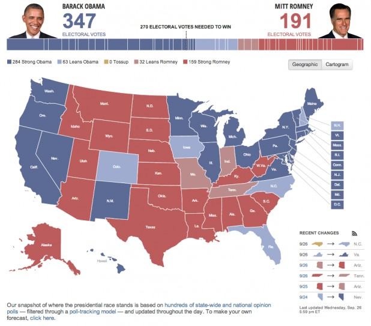
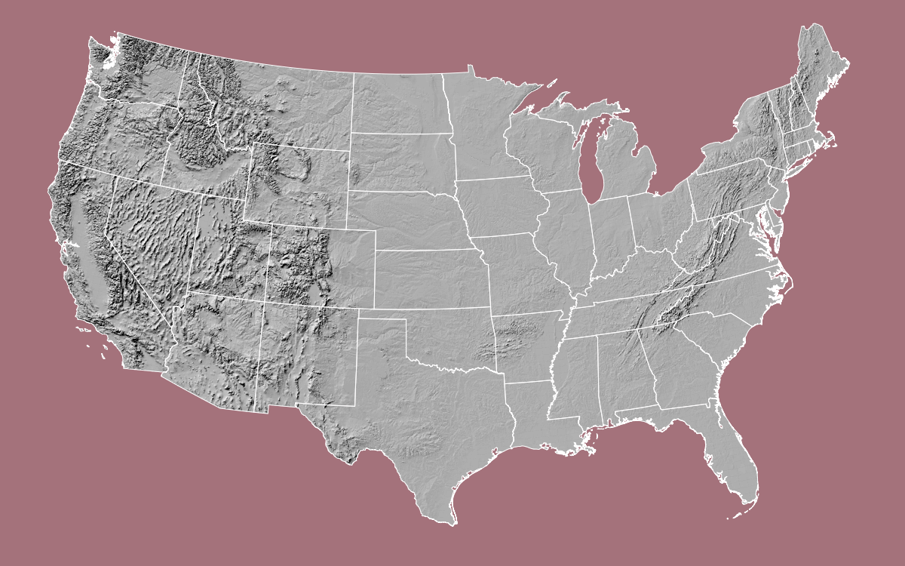
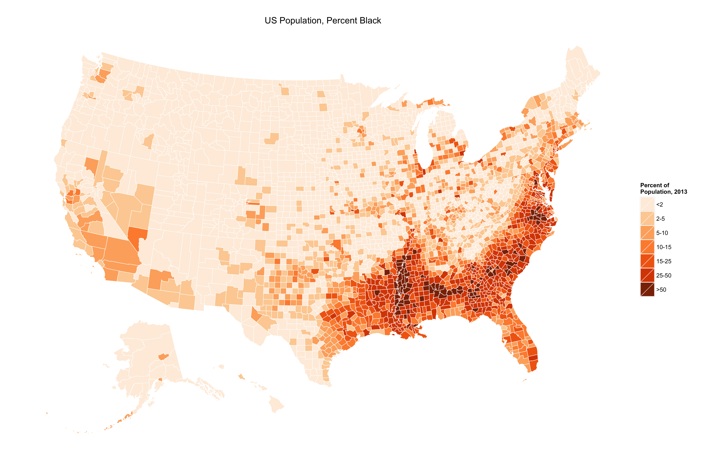

<style type='text/css'>
.reveal {
  font-size: 28px;  
}
</style>

```{r Setup, include=FALSE, results='hide', warning=FALSE}

library(devtools)
library(ggplot2)

opts_chunk$set(fig.path="assets/fig/wk05-fig-",
               cache.path="../cache/wk-05-working-",
               dev=c("png","pdf"),
               fig.width=6,
               fig.height=5,
               dpi=300,
               fig.show="hold",
               fig.lp="fig:",
               cache=FALSE,
               par=TRUE,
               echo=TRUE,
               message=FALSE,
               warning=FALSE)


```


# Maps

## Data Visualization, Week 5

### Kieran Healy, Duke University

---

## Outline for Today

0. Housekeeping
1. Reviewing the Homework
2. Git
3. Maps

--- 

## How to Navigate these Slides

- When you view them online, notice the compass in the bottom right corner
- You can go left or right, or sometimes down to more detail.
- Hit the `Escape` key to get an overview of all the slides. On a phone
  or tablet, pinch to get the slide overview.
- You can use the arrow keys (or swipe up and down) in this view, as well. 
- Hit `Escape` again to return to the slide you were looking at. 
- On a phone or tablet, tap the slide you want.

---

## Git

---

### Git is Horrible

- But it can help you keep track of what you did
- It's also where a lot of software development happens
- So it's worth getting a feel for it

---

### Simplest GitHub Use Case

- You have no account there.
- You download stuff from it.

---

### Next Simplest GitHub Use Case

- You have an account there.
- You fork (i.e., copy) things on other people's GitHub accounts to
  your GitHub account. 
- Then you clone (i.e., copy, or download) them to your laptop.
- This kind of confusing, doubled-up, garbage terminology is typical of Git. 

--- 

### Basic One-Person Regular Git Use Case

- You have a file under version control.
- You make a change to it and save the file.
- You stage or `add` a snapshot of the changed files, 
- Then you `commit` the snapshot of changes to the
repository, with a message saying what you did.

---


### Basic One-Person Regular Git Use Case

- You have a file under version control.
- You make a change to it and save the file.
- You stage or `add` a snapshot of the changed files, 
- Then you `commit` the snapshot of changes to the
  repository, with a message saying what you did.
- You `push` that change up to e.g. GitHub.

---

### Tutorial

- https://try.github.io/levels/1/challenges/1

---

## Data Manipulation


---

## Maps

---

### 2012 US Election, Winner by State



---

### 2012 US Election, Winner by County


---

### 2012 US Election, Winner by County Share


---

### 2012 US Election, Color-Centered


---

### 2012 US Election, Color-Centered, Scaled by Population


---

### 2012 US Election, Electoral College Cartogram


---

### Projections


---

### Projections


---

### Projections



---

## America's Ur-Choropleths

---


---



---


---


---

## Often, you don't need a 'real' map

---

## Statebins, by Bob Rudis

```{r}

devtools::install_github("hrbrmstr/statebins")

dat <- read.csv("http://www.washingtonpost.com/wp-srv/special/business/states-most-threatened-by-trade/states.csv?cache=1", stringsAsFactors=FALSE)

```

---

```{r}

head(dat)

```

---

```{r}

p <- statebins(dat, "state", "avgshare94_00", breaks=4, 
                labels=c("0-1", "1-2", "2-3", "3-4"),
                legend_title="Share of workforce with jobs lost or threatened by trade",
                font_size=3)
    
p + theme(legend.position="bottom") +
    ggtitle("1994-2000")


```

---

```{r}

p <- statebins_continuous(dat, "state", "avgshare01_07",
               legend_title="Share of workforce with jobs lost or threatened by trade",
               brewer_pal = "OrRd",               
                font_size=3)
    
p + theme(legend.position="bottom") +
    ggtitle("2001-2007")


```

---

```{r}

library(httr)
library(dplyr)

election_2012 <- GET("https://raw.githubusercontent.com/hrbrmstr/statebins/master/tmp/election2012.csv")

results <- read.csv(textConnection(content(election_2012, as="text")),
                    header=TRUE, stringsAsFactors=FALSE)

results <- results %>%
    mutate(color=ifelse(is.na(Obama), "#2166ac", "#b2182b")) %>%
    select(state, color)

```

---

```{r}

head(results, 15)

```

---

```{r}

results %>%
    statebins_manual(font_size=4, text_color = "white",
                     labels=c("Romney", "Obama"),
                     legend_position="right",
                     legend_title="Winner")

```

---

## US County Maps in R

### From the Terminal
`git clone https://github.com/kjhealy/us-county.git`

- Or clone it in your browser, or git client

---
