<style type='text/css'>
.reveal {
  font-size: 28px;  
}
</style>


# Maps

## Data Visualization, Week 5

### Kieran Healy, Duke University

---

## Outline for Today

0. Housekeeping
1. Reviewing the Homework
2. Git
3. Maps

--- 

## How to Navigate these Slides

- When you view them online, notice the compass in the bottom right corner
- You can go left or right, or sometimes down to more detail.
- Hit the `Escape` key to get an overview of all the slides. On a phone
  or tablet, pinch to get the slide overview.
- You can use the arrow keys (or swipe up and down) in this view, as well. 
- Hit `Escape` again to return to the slide you were looking at. 
- On a phone or tablet, tap the slide you want.

---

## Git

---

### Git is Horrible

- But it can help you keep track of what you did
- It's also where a lot of software development happens
- So it's worth getting a feel for it

---

### Simplest GitHub Use Case

- You have no account there.
- You download stuff from it.

---

### Next Simplest GitHub Use Case

- You have an account there.
- You fork (i.e., copy) things on other people's GitHub accounts to
  your GitHub account. 
- Then you clone (i.e., copy, or download) them to your laptop.
- This kind of confusing, doubled-up, garbage terminology is typical of Git. 

--- 

### Basic One-Person Regular Git Use Case

- You have a file under version control.
- You make a change to it and save the file.
- You stage or `add` a snapshot of the changed files, 
- Then you `commit` the snapshot of changes to the
repository, with a message saying what you did.

---


### Basic One-Person Regular Git Use Case

- You have a file under version control.
- You make a change to it and save the file.
- You stage or `add` a snapshot of the changed files, 
- Then you `commit` the snapshot of changes to the
  repository, with a message saying what you did.
- You `push` that change up to e.g. GitHub.

---

### Tutorial

- https://try.github.io/levels/1/challenges/1

---

## Data Manipulation

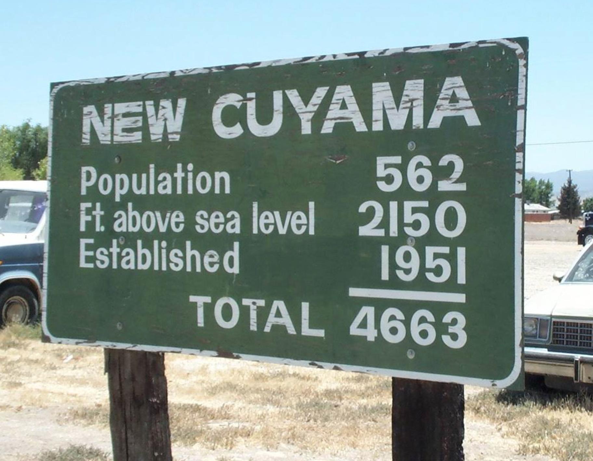

---

## Maps

---

### 2012 US Election, Winner by State

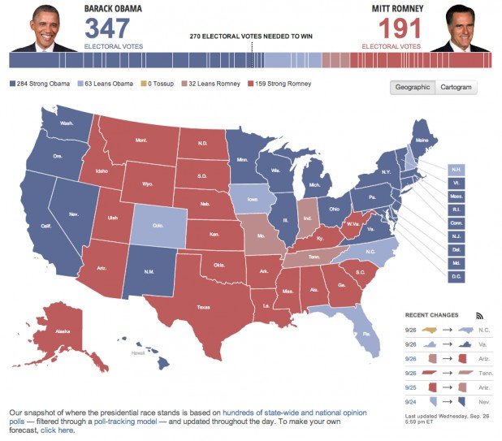

---

### 2012 US Election, Winner by County

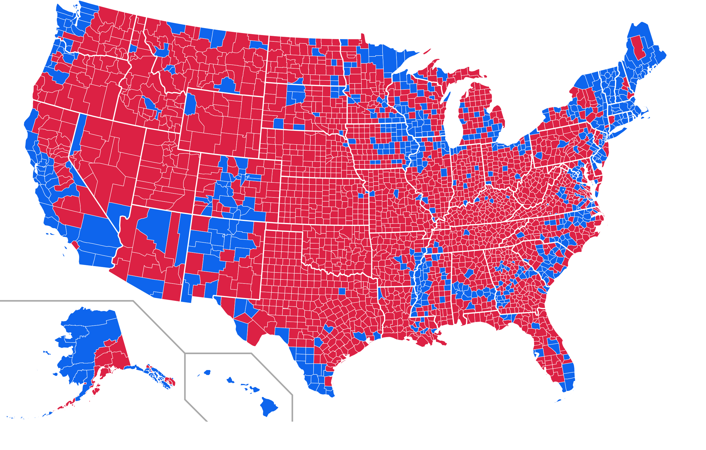

---

### 2012 US Election, Winner by County Share


---

### 2012 US Election, Color-Centered

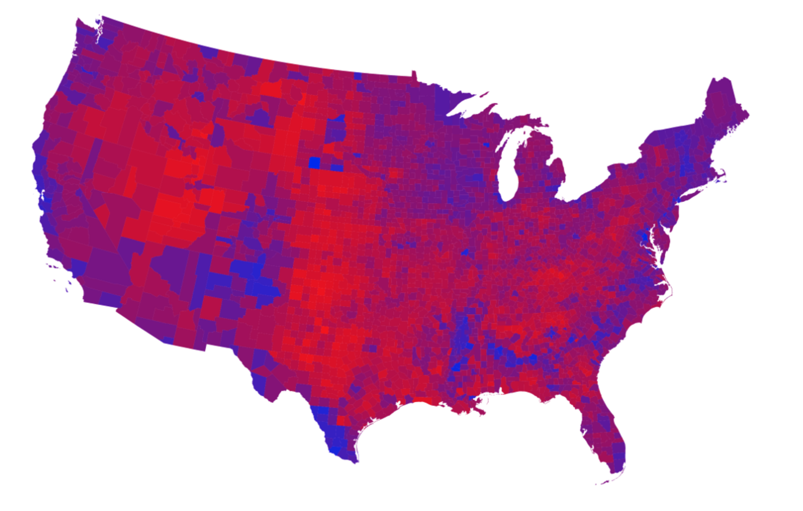

---

### 2012 US Election, Color-Centered, Scaled by Population


---

### 2012 US Election, Electoral College Cartogram

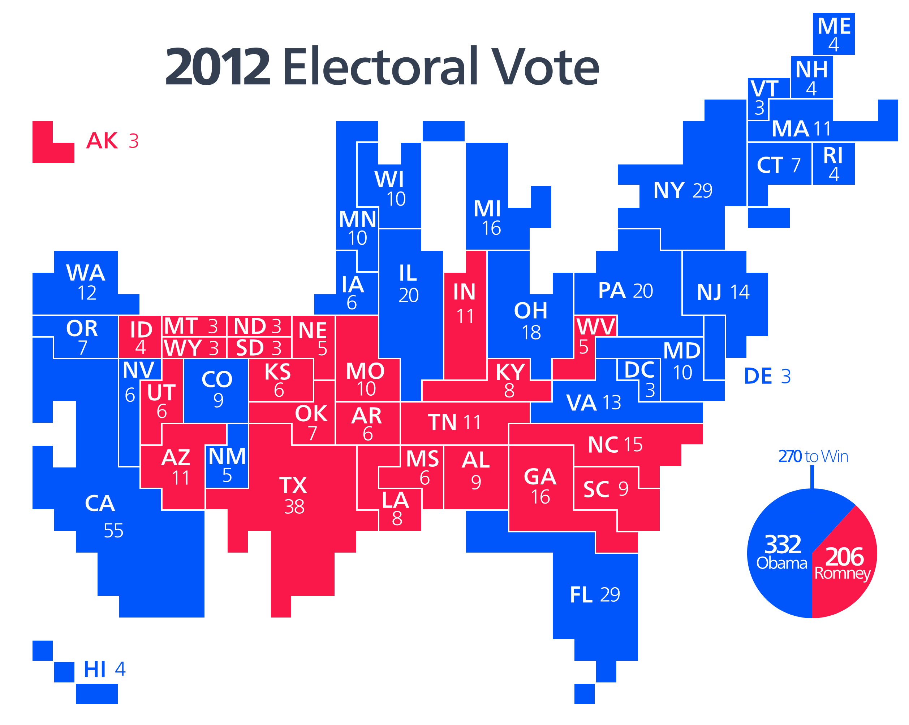

---

### Projections

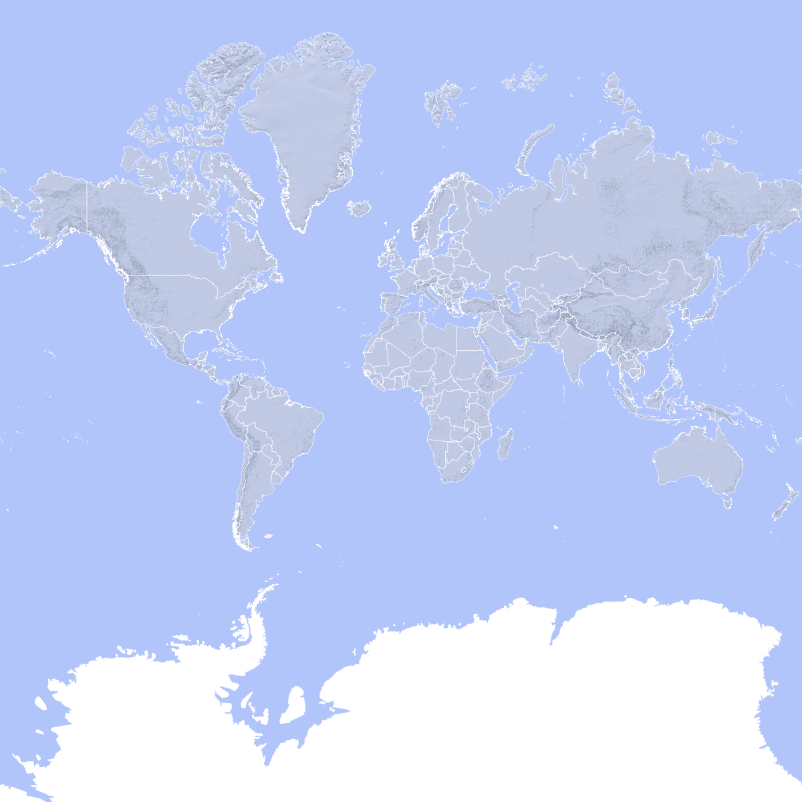

---

### Projections

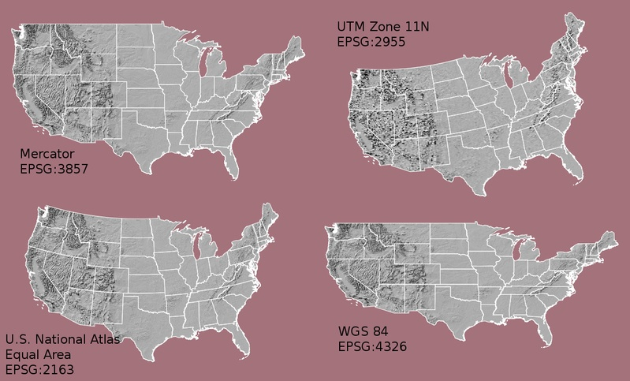

---

### Projections

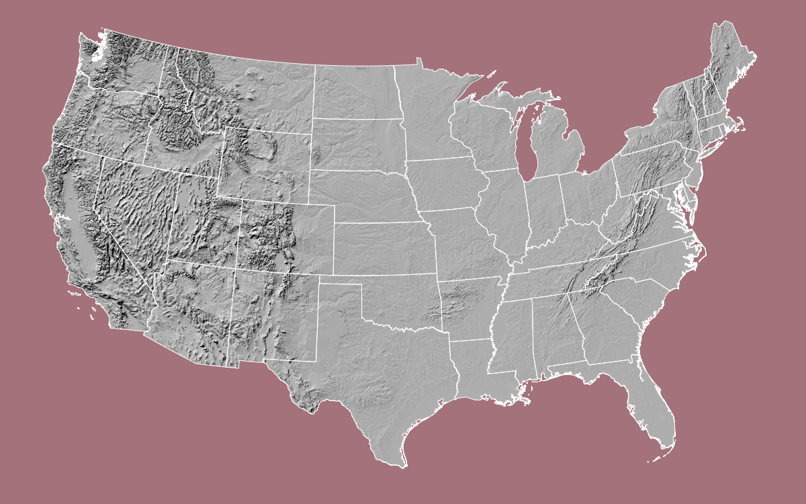

---

## America's Ur-Choropleths

---

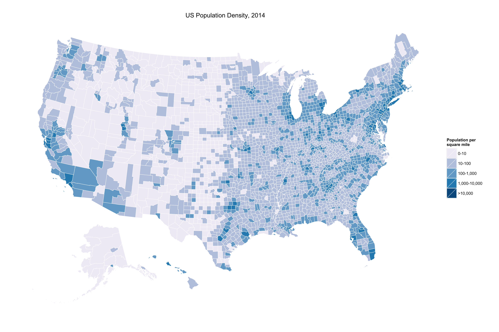

---

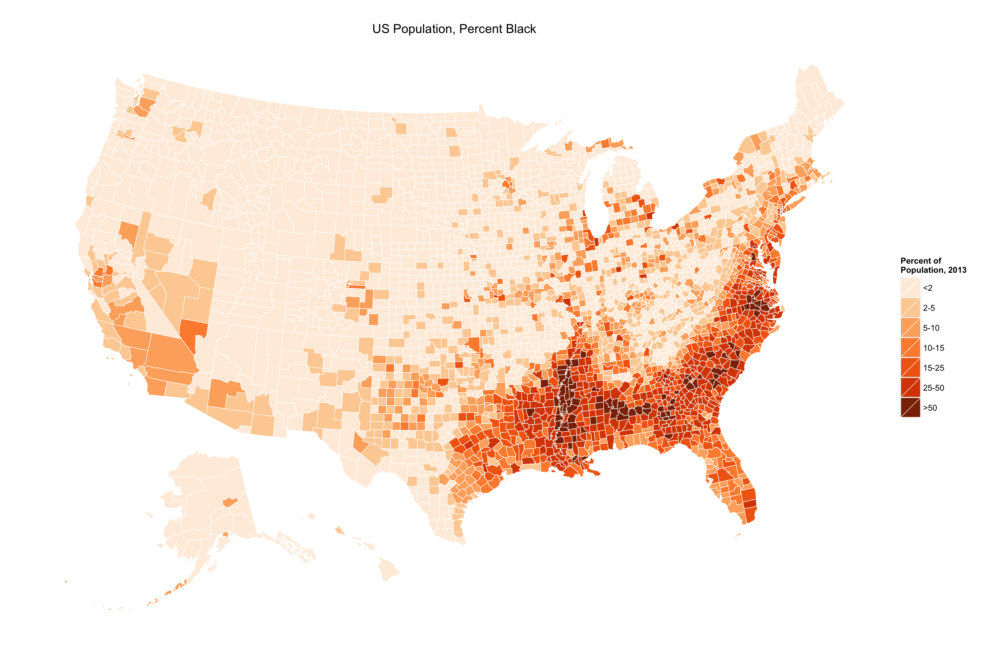

---

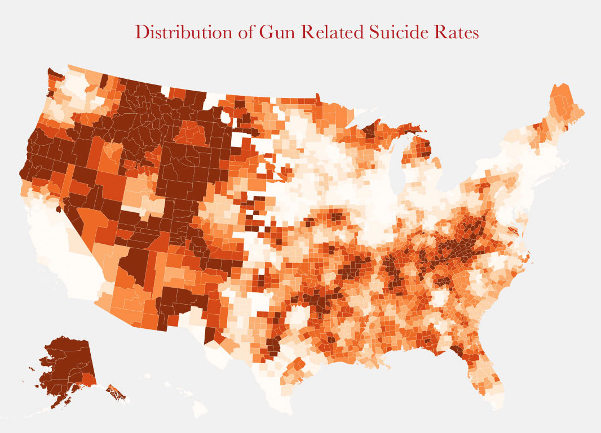

---

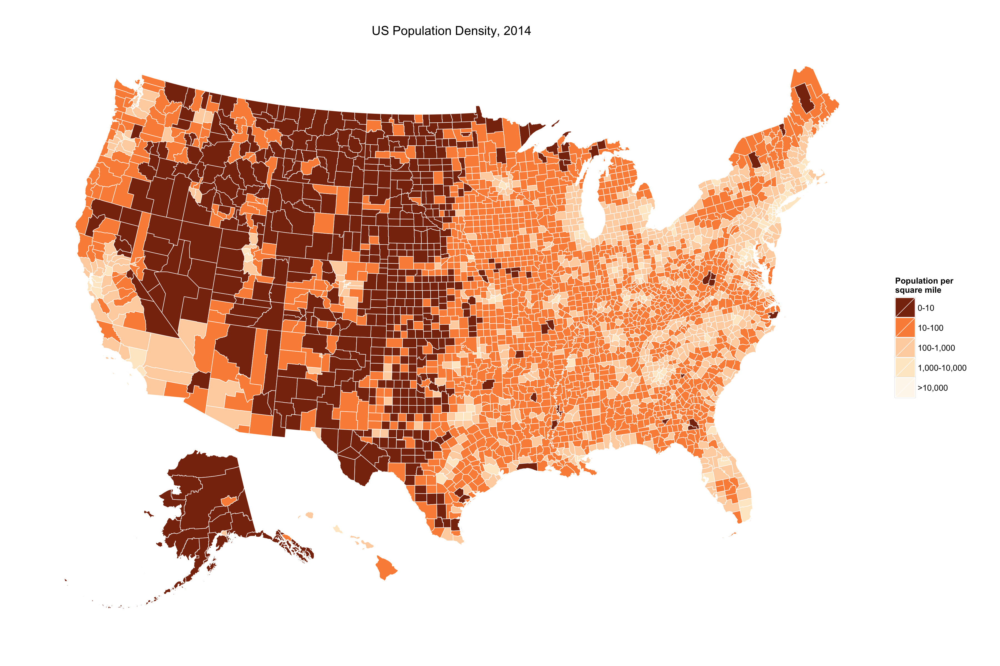

---

## Often, you don't need a 'real' map

---

## Statebins, by Bob Rudis


```r
devtools::install_github("hrbrmstr/statebins")
```

```
## Downloading GitHub repo hrbrmstr/statebins@master
## Installing statebins
## '/Library/Frameworks/R.framework/Resources/bin/R' --no-site-file  \
##   --no-environ --no-save --no-restore CMD INSTALL  \
##   '/private/var/folders/0c/hc2fp3hn3sl1r1pv973q5dsc0000gn/T/Rtmp6batHh/devtools1459e605ca68e/hrbrmstr-statebins-23d1e11'  \
##   --library='/Users/kjhealy/Library/R/library' --install-tests 
## 
## Reloading installed statebins
```

```r
dat <- read.csv("http://www.washingtonpost.com/wp-srv/special/business/states-most-threatened-by-trade/states.csv?cache=1", stringsAsFactors=FALSE)
```

---


```r
head(dat)
```

```
##   fipst stab          state workers1994 workers1995 workers1996
## 1    37   NC North Carolina        3831        2631        8716
## 2     1   AL        Alabama        1504        3527        7627
## 3    28   MS    Mississippi        1613        3344        4454
## 4     5   AR       Arkansas        1376        1107        1473
## 5    47   TN      Tennessee        3210        4149        7297
## 6    45   SC South Carolina        1991        1289        3422
##   workers1997 workers1998 workers1999 workers2000 workers2001 workers2002
## 1       12324        9428       12414        4790       12596       19564
## 2        6858        5340        8697        3919        4400        9895
## 3        1938        3108        6143        2839        3292        4796
## 4        2426        2559        2653         604        3041        3741
## 5        7544        7435        5706        5107        7104        8137
## 6         975        3922        1739        2427        6296        6585
##   workers2003 workers2004 workers2005 workers2006 workers2007 workers2008
## 1       21126       11435       13167       10602       14815       11767
## 2        3285        3156        1895        5358        4156        6377
## 3        3785        1350        1345        1807        2246        3366
## 4        3417        1093        2223        3781        4905        3220
## 5        7528        2673        6156        4849        8254        7262
## 6        5690        4623        5913        5270        3473        4479
##   workers2009 workers2010 workers2011 workers2012 workers2013
## 1       11533       12746        4120        2953        3301
## 2        6661        5306         571        1033         834
## 3        3262         473          77         386         226
## 4        2891        3088        2239        3769         507
## 5        7647        7938        7100        2108        2606
## 6        5846        2575        1513        1864        1321
##   share_cut1994 share_cut1995 share_cut1996 share_cut1997 share_cut1998
## 1           1.4           0.9           3.0           4.1           3.0
## 2           1.1           2.4           5.2           4.6           3.5
## 3           2.0           3.9           5.1           2.2           3.4
## 4           1.6           1.3           1.6           2.7           2.7
## 5           1.6           2.0           3.4           3.5           3.3
## 6           1.5           1.0           2.5           0.7           2.7
##   share_cut1999 share_cut2000 share_cut2001 share_cut2002 share_cut2003
## 1           3.9           1.5           3.8           6.1           6.7
## 2           5.6           2.5           2.8           6.5           2.2
## 3           6.7           3.1           3.6           5.4           4.3
## 4           2.8           0.6           3.1           3.9           3.6
## 5           2.5           2.2           3.1           3.6           3.3
## 6           1.2           1.6           4.1           4.5           3.9
##   share_cut2004 share_cut2005 share_cut2006 share_cut2007 share_cut2008
## 1           3.6           4.1           3.2           4.3           3.4
## 2           2.1           1.2           3.3           2.6           3.9
## 3           1.5           1.5           2.0           2.5           3.7
## 4           1.1           2.3           3.8           4.9           3.2
## 5           1.2           2.7           2.1           3.5           3.0
## 6           3.1           3.9           3.4           2.2           2.8
##   share_cut2009 share_cut2010 share_cut2011 share_cut2012 share_cut2013
## 1           3.5           4.1           1.3           0.9           1.0
## 2           4.3           3.6           0.4           0.7           0.6
## 3           3.7           0.6           0.1           0.5           0.3
## 4           3.0           3.3           2.4           3.9           0.5
## 5           3.4           3.7           3.2           0.9           1.1
## 6           3.9           1.8           1.0           1.2           0.9
##   avgshare avgshare94_00 avgshare01_07 avgshare08_12
## 1     3.56          2.53          4.56          2.64
## 2     3.22          3.55          2.95          2.58
## 3     2.94          3.77          2.99          1.71
## 4     2.89          1.91          3.27          3.16
## 5     2.86          2.64          2.77          2.85
## 6     2.61          1.60          3.57          2.14
```

---


```r
p <- statebins(dat, "state", "avgshare94_00", breaks=4, 
                labels=c("0-1", "1-2", "2-3", "3-4"),
                legend_title="Share of workforce with jobs lost or threatened by trade",
                font_size=3)
    
p + theme(legend.position="bottom") +
    ggtitle("1994-2000")
```

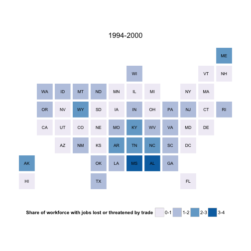 

---


```r
p <- statebins_continuous(dat, "state", "avgshare01_07",
               legend_title="Share of workforce with jobs lost or threatened by trade",
               brewer_pal = "OrRd",               
                font_size=3)
    
p + theme(legend.position="bottom") +
    ggtitle("2001-2007")
```

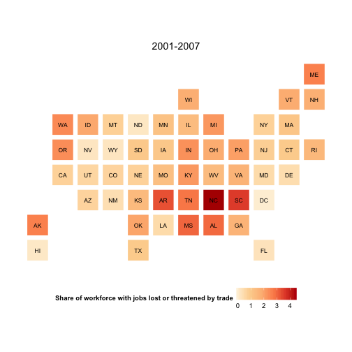 

---


```r
library(httr)
library(dplyr)

election_2012 <- GET("https://raw.githubusercontent.com/hrbrmstr/statebins/master/tmp/election2012.csv")

results <- read.csv(textConnection(content(election_2012, as="text")),
                    header=TRUE, stringsAsFactors=FALSE)

results <- results %>%
    mutate(color=ifelse(is.na(Obama), "#2166ac", "#b2182b")) %>%
    select(state, color)
```

---


```r
head(results, 15)
```

```
##    state   color
## 1     AL #2166ac
## 2     AK #2166ac
## 3     AZ #2166ac
## 4     AR #2166ac
## 5     CA #b2182b
## 6     CO #b2182b
## 7     CT #b2182b
## 8     DE #b2182b
## 9     DC #b2182b
## 10    FL #b2182b
## 11    GA #2166ac
## 12    HI #b2182b
## 13    ID #2166ac
## 14    IL #b2182b
## 15    IN #2166ac
```

---


```r
results %>%
    statebins_manual(font_size=4, text_color = "white",
                     labels=c("Romney", "Obama"),
                     legend_position="right",
                     legend_title="Winner")
```

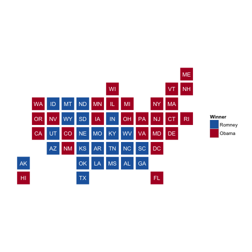 

---

## US County Maps in R

### From the Terminal
`git clone https://github.com/kjhealy/us-county.git`

- Or clone it in your browser, or git client

---
