<style type='text/css'>
.reveal {
  font-size: 28px;  
}
</style>


# Refining Plots

## Data Visualization, Week 6

### Kieran Healy, Duke University

---

## Outline for Today

0. Housekeeping
1. Building up plots, again
2. ggplot themes
3. Writing a small helper function
4. Custom plots and layouts

--- 

## How to Navigate these Slides

- When you view them online, notice the compass in the bottom right corner
- You can go left or right, or sometimes down to more detail.
- Hit the `Escape` key to get an overview of all the slides. On a phone
  or tablet, pinch to get the slide overview.
- You can use the arrow keys (or swipe up and down) in this view, as well. 
- Hit `Escape` again to return to the slide you were looking at. 
- On a phone or tablet, tap the slide you want.

---

## Building up Plots, Again

---


```r
library(ggplot2)
library(scales)
library(MASS)
library(stringr)
library(splines)

theme_set(theme_gray())
```

---

### ASA Membership & Revenue data

- On Github: [ASA Sections](https://github.com/kjhealy/asa-sections)
- Or manually: 


```r
asa.url <- "https://raw.githubusercontent.com/kjhealy/asa-sections/master/data/asa-section-membership.csv"
asa.data <- read.csv((url(asa.url)), header = TRUE)

## If you cloned the github repository, launch R in it and then
## asa.data <-  read.csv("data/asa-section-membership.csv", header=TRUE) 

dim(asa.data)
```

```
## [1] 52 18
```

```r
head(asa.data)
```

```
##                                Section         Sname X2005 X2006 X2007
## 1      Aging and the Life Course (018)         Aging   598   603   614
## 2     Alcohol, Drugs and Tobacco (030) Alcohol/Drugs   301   304   303
## 3 Altruism and Social Solidarity (047)      Altruism    NA    NA    NA
## 4            Animals and Society (042)       Animals   209   208   218
## 5             Asia/Asian America (024)          Asia   365   379   398
## 6            Body and Embodiment (048)          Body    NA    NA    NA
##   X2008 X2009 X2010 X2011 X2012 X2013 X2014 X2015 Beginning Revenues
## 1   606   624   605   612   620   610   580   612     12752    12104
## 2   288   255   213   226   200   195   173   171     11933     1144
## 3    NA   139   216   320   305   306   318   307      1139     1862
## 4   176   180   167   172   149   160   154   141       473      820
## 5   368   405   351   377   337   349   336   313      9056     2116
## 6    NA   302   295   307   306   309   312   321      3408     1618
##   Expenses Ending Journal
## 1    12007  12849      No
## 2      400  12677      No
## 3     1875   1126      No
## 4     1116    177      No
## 5     1710   9462      No
## 6     1920   3106      No
```

---

### Quick & Dirty Function for custom colors ###


```r
my.colors <- function (palette = "cb") {
    cb.palette <- c("#999999", "#E69F00", "#56B4E9", "#009E73",
                    "#F0E442", "#0072B2", "#D55E00", "#CC79A7")
    rcb.palette <- rev(cb.palette)
    bly.palette <- c("#E69F00", "#0072B2", "#999999", "#56B4E9",
                     "#009E73", "#F0E442", "#D55E00", "#CC79A7")
    if (palette == "cb")
        return(cb.palette)
    else if (palette == "rcb")
        return(rcb.palette)
    else if (palette == "bly")
        return(bly.palette)
    else stop("Choose cb, rcb, or bly ony.")
}
```

---

## Make sure the figures/ directory is available


```r
ifelse(!dir.exists(file.path("figures")),
       dir.create(file.path("figures")),
       FALSE)
```

```
## [1] FALSE
```

---

## Starting with the basics again


```r
p <- ggplot(asa.data, aes(x=X2014, y=Revenues, label=Sname))

p0 <- p + geom_point()
```

---


```r
print(p0)
```

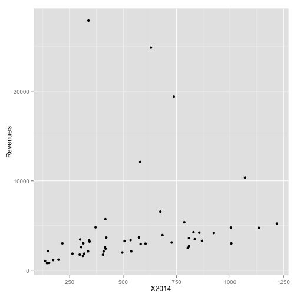 

---

## Add a smoother


```r
p <- ggplot(asa.data, aes(x=X2014, y=Revenues, label=Sname))

p0 <- p + geom_smooth() +
    geom_point()
```

---

```r
print(p0)
```

```
## geom_smooth: method="auto" and size of largest group is <1000, so using loess. Use 'method = x' to change the smoothing method.
```

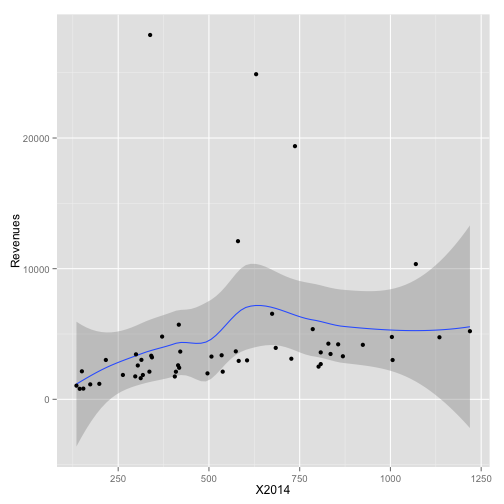 

---

## Pick out some outliers


```r
p <- ggplot(asa.data, aes(x=X2014, y=Revenues, label=Sname))

p0 <- p + geom_smooth() +
    geom_point() +
    geom_text(data=subset(asa.data, Revenues > 7000)) 
```

---

```r
print(p0)
```

```
## geom_smooth: method="auto" and size of largest group is <1000, so using loess. Use 'method = x' to change the smoothing method.
```

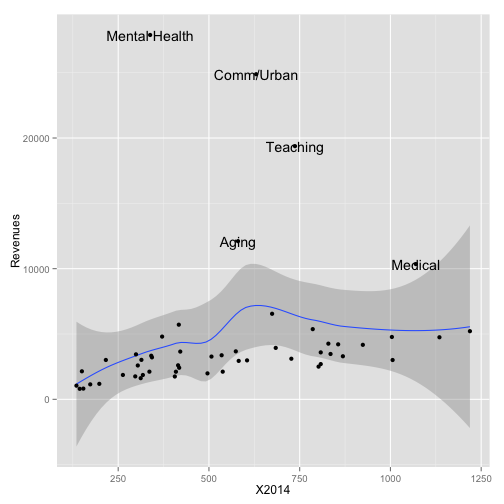 

---

## Introduce a third variable ##


```r
p <- ggplot(asa.data, aes(x=X2014, y=Revenues, label=Sname))

p0 <- p + geom_smooth() +
    geom_point(aes(color = Journal)) +
    geom_text(data=subset(asa.data, Revenues > 7000)) 
```

---


```r
print(p0)
```

```
## geom_smooth: method="auto" and size of largest group is <1000, so using loess. Use 'method = x' to change the smoothing method.
```

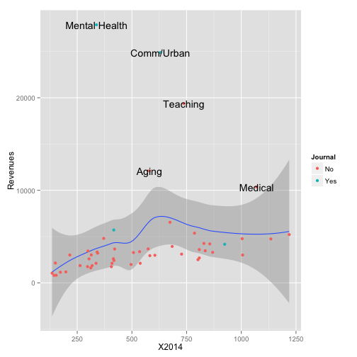 

---


## Change the fitted line ##


```r
p <- ggplot(asa.data, aes(x=X2014, y=Revenues, label=Sname))

p0 <- p + geom_smooth(method = "lm",
                  se = FALSE,
                  color = "gray80") +
    geom_point(aes(color = Journal)) +
    geom_text(data=subset(asa.data, Revenues > 7000)) 
```

---


```r
print(p0)
```

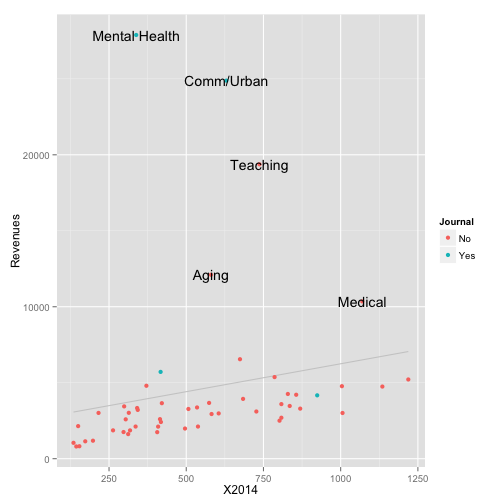 

---

## Tidy up the labeled text ##


```r
p <- ggplot(asa.data, aes(x=X2014, y=Revenues, label=Sname))

p0 <- p + geom_smooth(method = "lm",
                  se = FALSE,
                  color = "gray80") +
    geom_point(aes(color = Journal)) +
    geom_text(data=subset(asa.data, Revenues > 7000),
              size = 2,
              aes(x=X2014+10,
                  hjust = 0,
                  lineheight = 0.7)) 
```

---


```r
print(p0)
```

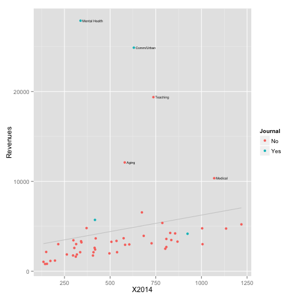 

---


## Label the Axes and Scales ##


```r
p <- ggplot(asa.data, aes(x=X2014, y=Revenues, label=Sname))

p0 <- p + geom_smooth(method = "lm",
                  se = FALSE,
                  color = "gray80") +
    geom_point(aes(color = Journal)) +
    geom_text(data=subset(asa.data, Revenues > 7000),
              size = 2,
              aes(x=X2014+10,
                  hjust = 0,
                  lineheight = 0.7)) +

   labs(x="Membership",
        y="Revenues",
        color = "Section has own Journal") 
```

---


```r
print(p0)
```

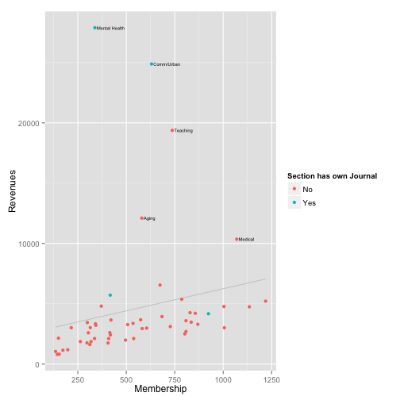 

---

## Fix Tick Marks and Colors ##


```r
p <- ggplot(asa.data, aes(x=X2014, y=Revenues, label=Sname))

p0 <- p + geom_smooth(method = "lm",
                  se = FALSE,
                  color = "gray80") +
    geom_point(aes(color = Journal)) +
    geom_text(data=subset(asa.data, Revenues > 7000),
              size = 2,
              aes(x=X2014+10,
                  hjust = 0,
                  lineheight = 0.7)) +
    scale_y_continuous(labels = dollar) +
    scale_color_manual(values = my.colors("bly")) +
    labs(x="Membership",
        y="Revenues",
        color = "Section has own Journal") 
```

---


```r
print(p0)
```

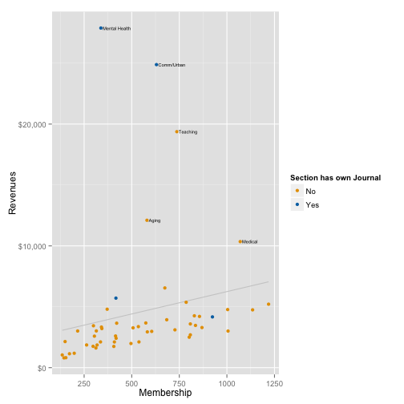 

---

## Add a title and move the legend ##


```r
p <- ggplot(asa.data, aes(x=X2014, y=Revenues, label=Sname))

p0 <- p + geom_smooth(method = "lm",
                  se = FALSE,
                  color = "gray80") +
    geom_point(aes(color = Journal)) +
    geom_text(data=subset(asa.data, Revenues > 7000),
              size = 2,
              aes(x=X2014+10,
                  hjust = 0,
                  lineheight = 0.7)) +
    scale_y_continuous(labels = dollar) +
    scale_color_manual(values = my.colors("bly")) +
    labs(x="Membership",
        y="Revenues",
        color = "Section has own Journal") +
    theme(legend.position = "bottom") +
    ggtitle("ASA Sections, Membership vs Revenues")
```

---


```r
print(p0)
```

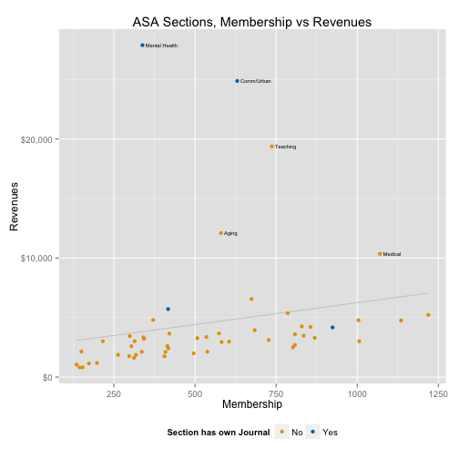 

---

## Change the theme ##


```r
theme_set(theme_minimal())

print(p0)
```

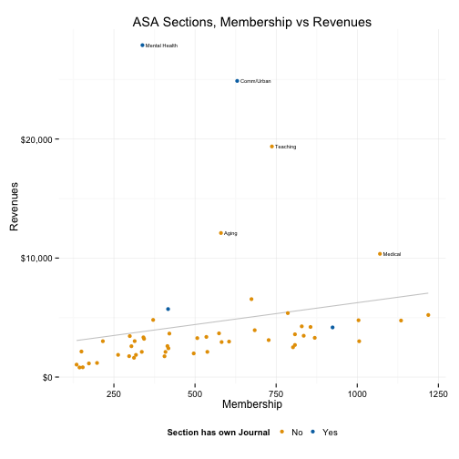 

---

## Change the theme ##


```r
theme_set(theme_light())

print(p0)
```

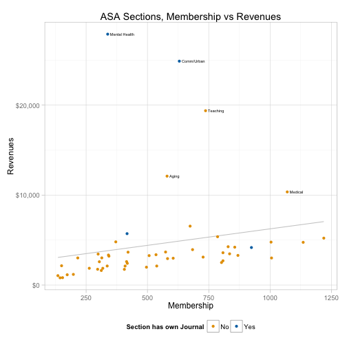 

---

## Moar themes ##


```r
library(ggthemes)
theme_set(theme_fivethirtyeight())
```

```
## Warning: New theme missing the following elements: panel.margin.x,
## panel.margin.y
```

```r
print(p0)
```

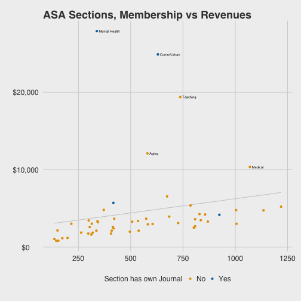 

---


## Moar themes ##


```r
theme_set(theme_economist())
```

```
## Warning: New theme missing the following elements: legend.box,
## panel.margin.x, panel.margin.y
```

```r
print(p0)
```

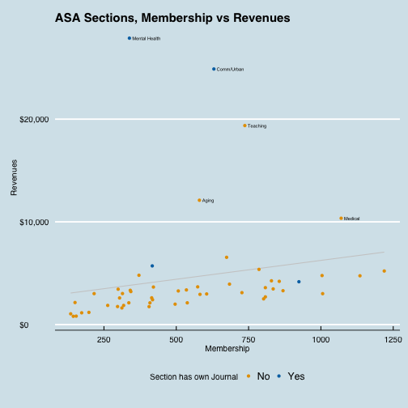 

---

## Moar themes ##


```r
theme_set(theme_wsj())
```

```
## Warning: New theme missing the following elements: panel.margin.x,
## panel.margin.y
```

```r
print(p0)
```

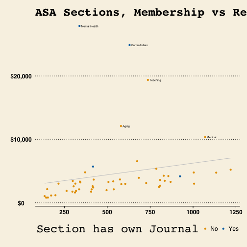 

---

## If you must ##


```r
theme_set(theme_stata())
```

```
## Warning: New theme missing the following elements: panel.margin.x,
## panel.margin.y
```

```r
print(p0)
```

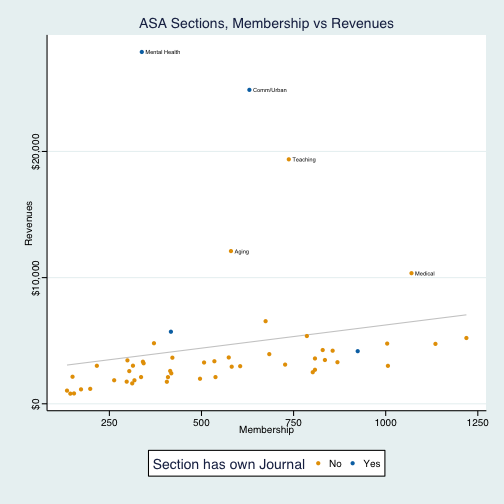 


---


```

---

## Membership trends over time


```r
library(tidyr)
library(dplyr)

yrs <- colnames(asa.data) %in% paste("X", 2005:2015, sep="")

data.m <- subset(asa.data, select = c("Sname", colnames(asa.data)[yrs]))

data.m <- gather(data.m, Year, Members, X2005:X2015)

data.m$Year <- as.integer(str_replace(data.m$Year, "X", ""))
```

---


## Membership trends over time


```r
trend.tab <- data.m %>% group_by(Year) %>%
    mutate(yr.tot = sum(Members, na.rm=TRUE)) %>%
    group_by(Sname) %>%
    na.omit() %>%
    mutate(Ave = mean(Members, na.rm=TRUE),
           Dif = Members - Ave,
           Pct.All = round((Members/yr.tot*100), 2),
           Age = length(Members)) %>%
    group_by(Sname) %>%
    mutate(Index = (Members / first(Members, order_by = Year))*100,
           AveInd = mean(Index))
```

---


## Membership trends over time


```r
index.labs <- trend.tab %>%
    filter(Year == 2015) %>%
    ungroup() %>%
    filter(min_rank(desc(Index)) < 12 | min_rank(desc(Index)) > 44)


index.low <- trend.tab %>%
    filter(Year == 2015) %>%
    ungroup() %>%
    filter(min_rank(Index) < 12)


index.high <- trend.tab %>%
    filter(Year == 2015) %>%
    ungroup() %>%
    filter(min_rank(desc(Index)) < 12)

ind.all <- trend.tab$Sname %in% index.labs$Sname
ind.low <- trend.tab$Sname %in% index.low$Sname
ind.high <- trend.tab$Sname %in% index.high$Sname


trend.tab$Track.all <- ind.all
trend.tab$Track.low <- ind.low
trend.tab$Track.high <- ind.high
```

---


```r
library(quantreg)

p <- ggplot(subset(trend.tab, Age==11 & AveInd < 105),
            aes(x=Year, y=Index, group=Sname, color = Track.low))

p0 <-  p + geom_smooth(method = "rqss", formula = y ~ qss(x), se = FALSE) +
    geom_hline(yintercept = 100) +
    geom_text(data=subset(index.low, Age==11 & AveInd < 105),
              aes(x=Year+0.2, y=Index+rnorm(1, sd=0.8),
                  label=Sname,
                  lineheight=0.8),
              hjust = 0,
              color = "black",
              size = 2.9) +
    expand_limits(x = c(2005:2016)) +
    scale_color_manual(values = my.colors("bly")[c(3, 1)]) +
    scale_x_continuous(breaks = c(seq(2005, 2015, 3))) +
    guides(color = FALSE) +
    ggtitle("Declining Sections. 2005 = 100")
```

---


```r
print(p0)
```

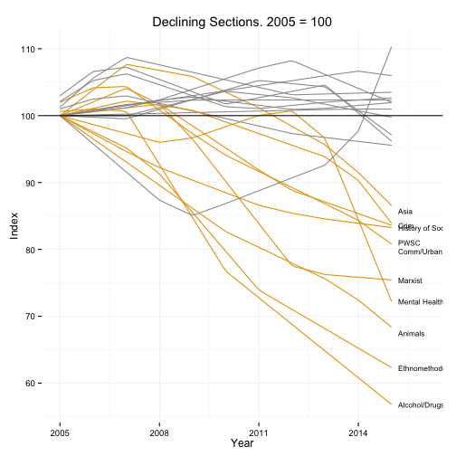 

---

#### Simple functions help you out


```r
plot.section <- function(section="Culture", x = "Year",
                         y = "Members", data = trend.tab,
                         smooth=FALSE){
    require(ggplot2)
    require(splines)
    ## Note use of aes_string() rather than aes() 
    p <- ggplot(subset(data, Sname==section),
            aes_string(x=x, y=y))

    if(smooth == TRUE) {
        p0 <- p + geom_smooth(color = my.colors("bly")[2],
                              size = 1.2, method = "lm",
                              formula = y ~ ns(x, 3)) +
            scale_x_continuous(breaks = c(seq(2005, 2015, 4))) +
            ggtitle(section)
    } else {
    p0 <- p + geom_line(color=my.colors("bly")[2], size=1.2) +
        scale_x_continuous(breaks = c(seq(2005, 2015, 4))) +
        ggtitle(section)
    }

    print(p0)
}
```

---


```r
plot.section()
```

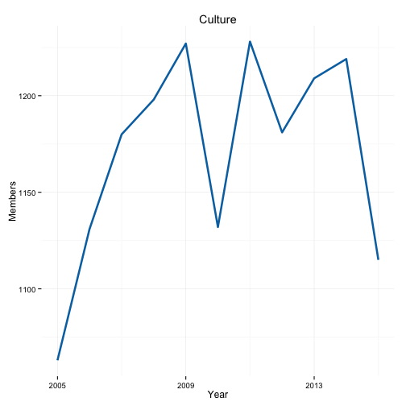 


---


```r
plot.section("Rationality")
```

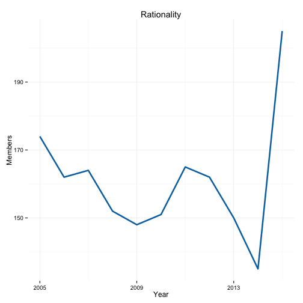 

---


```r
plot.section("OOW")
```

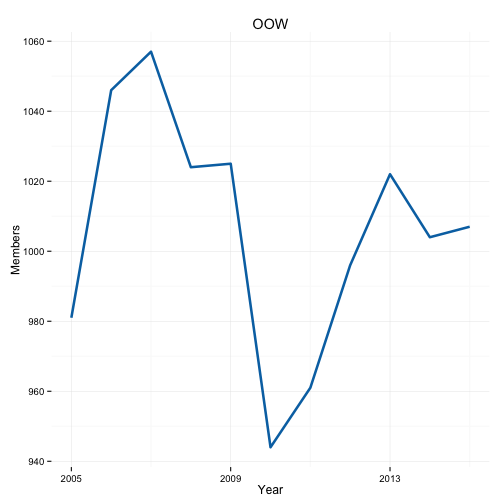 

---


```r
plot.section("Sexualities", smooth = TRUE)
```

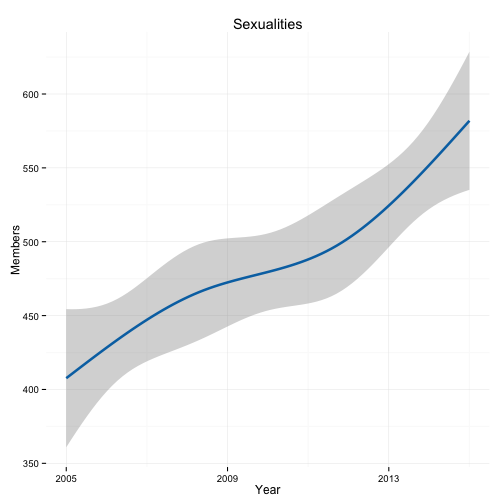 


---

### Note how this function could be made progressively more general

- E.g. calculate breaks from the data
- Allow `geom_smooth()` arguments to be passed through

---


```r
plot.section2 <- function(section="Culture", x = "Year",
                         y = "Members", data = trend.tab,
                         smooth=FALSE, ...){
    require(ggplot2)
    require(splines)
    ## Note use of aes_string() rather than aes() 
    p <- ggplot(subset(data, Sname==section),
            aes_string(x=x, y=y))

    if(smooth == TRUE) {
        p0 <- p + geom_smooth(color = my.colors("bly")[2],
                              size = 1.2, ...) + 
            scale_x_continuous(breaks = c(seq(2005, 2015, 4))) +
            ggtitle(section)
        } else {
    p0 <- p + geom_line(color=my.colors("bly")[2], size=1.2) +
        scale_x_continuous(breaks = c(seq(2005, 2015, 4))) +
        ggtitle(section)
    }

    print(p0)
}
```

---


```r
plot.section2("Comm/Urban", smooth = TRUE, method = "loess")
```

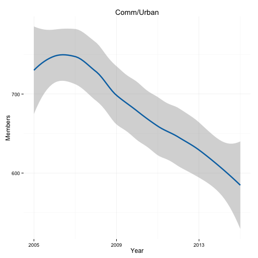 

---


```r
plot.section2("Children", smooth = TRUE, method = "lm", formula = y ~ ns(x, 2))
```

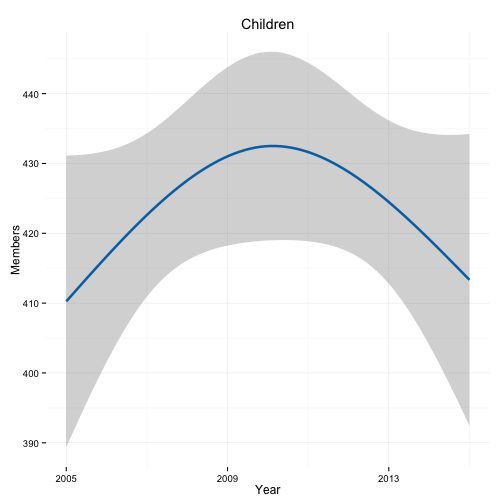 

---

## Another Example: Apple Sales Data

- `git clone https://github.com/kjhealy/apple`


```r
apple.url <- "https://raw.githubusercontent.com/kjhealy/apple/master/data/apple-all-products-quarterly-sales.csv"
apple.data <- read.csv((url(apple.url)), header = TRUE)

## If you cloned the github repository, launch R in it and then
## asa.data <-  read.csv("data/asa-section-membership.csv", header=TRUE) 

dim(apple.data)
```

```
## [1] 67  6
```

```r
head(apple.data)
```

```
##    Time Period iPhone iPad iPod   Mac
## 1 Q4/98      1     NA   NA   NA 0.944
## 2 Q1/99      2     NA   NA   NA 0.827
## 3 Q2/99      3     NA   NA   NA 0.905
## 4 Q3/99      4     NA   NA   NA 0.772
## 5 Q4/99      5     NA   NA   NA 1.377
## 6 Q1/00      6     NA   NA   NA 1.043
```

---


```r
library(dplyr)
library(ggplot2)
library(tidyr)
library(splines)
library(scales)
library(grid)

## data <- read.csv("data/apple-all-products-quarterly-sales.csv",
## header=TRUE)

apple.data$Date <- seq(as.Date("1998/12/31"), as.Date("2015/7/2"), by = "quarter")

apple.data.m <- gather(apple.data, Product, Sales, iPhone:Mac)
```

---


```r
head(apple.data.m)
```

```
##    Time Period       Date Product Sales
## 1 Q4/98      1 1998-12-31  iPhone    NA
## 2 Q1/99      2 1999-03-31  iPhone    NA
## 3 Q2/99      3 1999-07-01  iPhone    NA
## 4 Q3/99      4 1999-10-01  iPhone    NA
## 5 Q4/99      5 1999-12-31  iPhone    NA
## 6 Q1/00      6 2000-03-31  iPhone    NA
```

---


```r
p <- ggplot(subset(apple.data.m, Product!="iPod" & Period>30),
            aes(x=Date, y=Sales, color=Product, fill=Product))
p0 <- p + geom_point(size=1.3) +
    geom_smooth(size=0.8, se=FALSE, method = "loess") +
    theme(legend.position="top") +
    scale_x_date(labels = date_format("%Y"),
                 breaks=date_breaks("year")) +
    scale_colour_manual(values=my.colors()) +
    scale_fill_manual(values=my.colors()) + 
    labs(x="", y="Sales (millions)") 
```

---


```r
print(p0)
```

```
## Warning: Removed 4 rows containing missing values (stat_smooth).
```

```
## Warning: Removed 16 rows containing missing values (stat_smooth).
```

```
## Warning: Removed 20 rows containing missing values (geom_point).
```

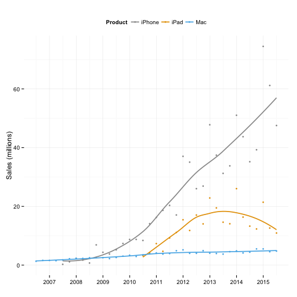 

---


```r
### Convert to time series objects
ipad <- apple.data.m %>%
    group_by(Product) %>%
    filter(Product=="iPad") %>%
    na.omit() %>%
    data.frame(.)

ipad.ts <- ts(ipad$Sales, start=c(2010, 2), frequency = 4)


iphone <- apple.data.m %>%
    group_by(Product) %>%
    filter(Product=="iPhone") %>%
    na.omit() %>%
    data.frame(.)

iphone.ts <- ts(iphone$Sales, start=c(2007, 2), frequency = 4)

mac <- apple.data.m %>%
    group_by(Product) %>%
    filter(Product=="Mac") %>%
    na.omit() %>%
    data.frame(.)

mac.ts <- ts(mac$Sales, start=c(1998, 4), frequency = 4)
```

---


```r
## Loess decomposition 

iphone.stl <- stl(iphone.ts, s.window = "periodic", t.jump = 1)
plot(iphone.stl)
```

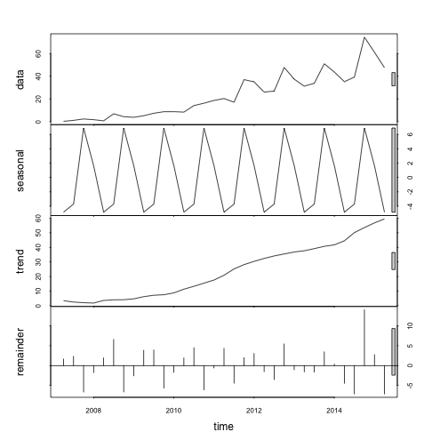 

---

#### Redraw the STL plot with GGplot


```r
iphone.stl2 <- stl(iphone.ts, s.window = 11, t.jump = 1)

ggiphone.stl <- data.frame(iphone.stl2$time.series)

ggiphone.stl$sales <- apple.data$iPhone %>% na.omit()

ind <- is.na(apple.data$iPhone)

ggiphone.stl$Date <- apple.data$Date[!ind]

ggiphone.stl$Product <- "iPhone"
```

--- 

#### Redraw the STL plot with GGplot


```r
p <- ggplot(ggiphone.stl, aes(x=Date, y=sales))
p1 <- p + geom_line() + ylab("Data")

p <- ggplot(ggiphone.stl, aes(x=Date, y=trend))
p2 <- p + geom_line() + ylab("Trend")

p <- ggplot(ggiphone.stl, aes(x=Date, y=seasonal))
p3 <- p + geom_line() + ylab("Seasonal")

p <- ggplot(ggiphone.stl, aes(x=Date, y=remainder))
p4 <- p + geom_bar(stat="identity", position="dodge") + ylab("Remainder")

p <- ggplot(ggiphone.stl, aes(x=Date, y=(seasonal/trend)*100))
p5 <- p + geom_line(stat="identity", position="dodge") + ylab("Seasonal/\nTrend (pct)")
```

---

#### Redraw the STL plot with GGplot


```r
grid.newpage()
vplayout <- function(x, y) viewport(layout.pos.row = x, layout.pos.col = y)
```

---


```r
pushViewport(viewport(layout = grid.layout(5, 1)))
print(p1, vp = vplayout(1, 1))
print(p2, vp = vplayout(2, 1))
print(p3, vp = vplayout(3, 1))
print(p4, vp = vplayout(4, 1))
print(p5, vp = vplayout(5, 1))
```

```
## ymax not defined: adjusting position using y instead
```

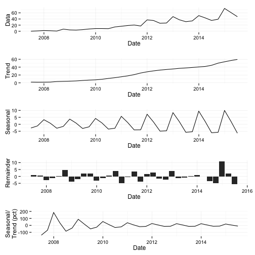 

---

### Try it for the Mac and iPad data

---
